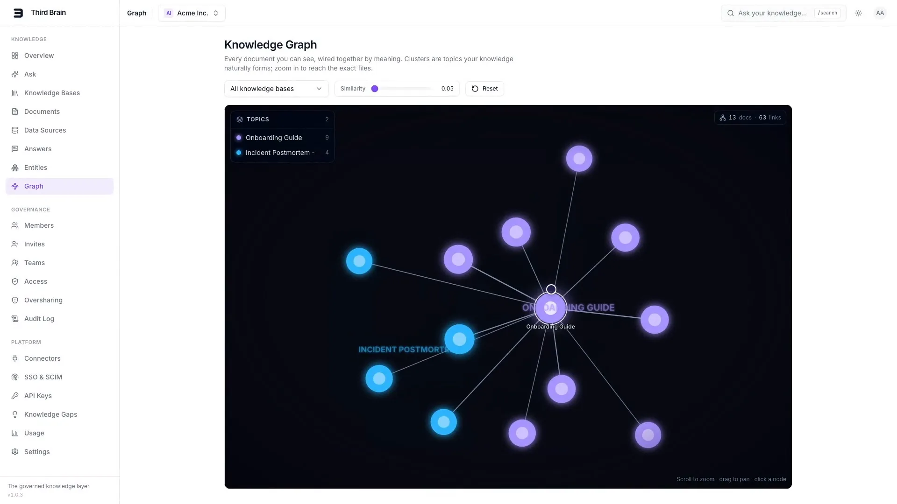

# Third Brain

### The documentation writes itself.

[](https://github.com/km322/Third-Brain/actions/workflows/ci.yml)
[](./LICENSE)
[](apps/api)
[](apps/web)

**Third Brain turns the work your team already does with LLMs into documentation.** Connect
its MCP server to the tools you already use - Claude Desktop, Claude Code, Cursor, your own
agents - and the decisions, answers, and notes that would normally evaporate at the end of a
chat get captured into a governed, searchable company brain. A dashboard shows the team what
the agents wrote. Retrieval is permission-aware and works with every model.

**It is free and open source, and you run it yourself.** Apache-2.0, the whole product in this
repository: no hosted tier, no waitlist, no seat count, no usage limits, nothing to pay for.
Clone it, run [`make selfhost`](#self-hosting-is-the-product), bring your own model keys - or no
keys at all - and your documents, embeddings and audit log stay on your own machines.

---

## The problem

Most of a company's real knowledge is created in conversations - a decision made in a Claude
thread, an answer an agent worked out, a runbook a teammate reasoned through with Cursor. And
almost none of it gets written down. The session ends, the tab closes, and the knowledge is
gone. Nobody writes the doc, because writing the doc is the boring part nobody has time for.

So the same questions get re-answered, decisions get re-litigated, and every new hire re-learns
what someone already figured out last quarter. The generation is easy now; the hard part is
that nothing captures it, nothing governs who can see it, and nothing lets the next person find
it.

## What it does

**Third Brain captures the work as it happens and makes it a governed, searchable brain.**

- **Documentation writes itself.** Point your agents' MCP client at Third Brain and, as they
  work, they call `add_knowledge` / `update_knowledge` to capture decisions, answers, and notes
  into the right collection. The write-back path runs through the same secret/DLP quarantine and
  the same permission model as everything else, so agents can only write where they're allowed
  to and never persist a leaked credential.
- **Governed retrieval you can trust.** org -> team -> user RBAC plus per-collection and
  per-document ACLs, enforced *at retrieval time* and pushed into the SQL `WHERE` clause. A chunk
  you can't see can never enter a search result or a prompt - not even indirectly. This is the
  trust pillar under everything the agents write.
- **Works with every model.** Any OpenAI-compatible endpoint (OpenAI, Azure OpenAI, Ollama,
  vLLM, or any compatible gateway) plus native connectors for **Anthropic** and **Google
  Gemini**, all over plain `httpx`, plus a deterministic **offline stub** so the whole stack runs
  with zero keys. You bring your own provider keys, and the only bill is your provider's.
- **A dashboard that tracks what agents wrote.** Usage analytics, API keys, teams, connectors,
  audit logs, and a Documents view with an **Agent-written** filter so you can see exactly what
  your agents have been capturing.
- **Built for speed.** Postgres + `pgvector` for permission-aware semantic (and hybrid) search,
  Redis caching hot queries and embeddings, and arq workers handling ingestion.

Think of it as gateway + dashboard ergonomics, but for **knowledge** instead of tokens - and the
knowledge fills itself in as your team works.

---

## 30-second quickstart

```bash
# 1. Copy environment templates (works fully offline - an included deterministic
#    offline stub provider means you don't even need a real API key to try it)
cp .env.example .env

# 2. Bring up Postgres(+pgvector), Redis, API, worker and web
make up-d          # detached (docker compose up --build -d); 'make logs' to follow

# 3. Run migrations + seed a demo org - 3 users, 3 knowledge bases
make migrate && make seed

# API      -> http://localhost:8000  (interactive docs at /docs)
# Web/app  -> http://localhost:3000
```

> [!WARNING]
> **Local development only.** This stack runs on the `.env.example` defaults - a `SECRET_KEY`
> and database password that are published in this repository, `ENVIRONMENT=development` (so
> the production boot guards never fire), and open signup. On any machine that is not your
> laptop, use [`make selfhost`](#self-hosting-is-the-product) instead: it generates real
> secrets and runs in production mode.

Then sign in to the dashboard with the seeded demo login: `admin@example.com`, plus the
password `make seed` just printed (randomly generated per seed - set `DEMO_PASSWORD` and the
`DEMO_ADMIN_EMAIL` / `DEMO_ENGINEER_EMAIL` / `DEMO_VIEWER_EMAIL` addresses in `.env` before
seeding to choose your own). The seed also creates `engineer@example.com` and
`viewer@example.com`, sharing that same password, so you can ask the same question as three
different roles and watch what each one is allowed to see.

> [!TIP]
> Add a real `OPENAI_API_KEY`, `ANTHROPIC_API_KEY`, or `GOOGLE_API_KEY` to `.env` for real
> embeddings and answers - but everything builds, seeds, and passes tests with zero keys thanks
> to the offline stub provider. The stub's embeddings are deterministic placeholders, so
> **offline** search rankings and answers exercise the full pipeline end-to-end but aren't a
> measure of retrieval *quality* - set a key to judge relevance.

<p align="center">
  <a href="docs/assets/third-brain-demo.mp4">
    
  </a>
</p>
<p align="center">
  <a href="docs/assets/third-brain-demo.mp4"><strong>Watch the 3-minute demo</strong></a><br>
  <sub>Ingest a document, ask a governed question, watch an agent capture a decision - and watch the same
  question return nothing to someone who isn't allowed to see it. Script: <a href="docs/DEMO.md">docs/DEMO.md</a>.</sub>
</p>

---

## Self-hosting is the product

There is no hosted service to sign up for: **you run Third Brain.** Your documents, your
embeddings, your provider keys and your audit log never leave your perimeter, because there is
nowhere else for them to go. One command stands up the production topology:

```bash
ADMIN_EMAIL=you@example.com make selfhost
```

That generates a hardened `.env` (fresh `SECRET_KEY`, fresh database password,
`ENVIRONMENT=production`), builds and starts the stack, waits for the API to pass its
healthcheck, and creates your first admin account. The dashboard is then at
`http://localhost:3000`, bound to loopback; run the script directly with
`./scripts/selfhost-init.sh --host <name-or-ip>` to publish it beyond this machine, and
terminate TLS in front of it (your own reverse proxy, or the bundled Cloudflare Tunnel overlay)
before exposing it to the internet.

It is Apache-2.0 and free: no tiers, no seat counts, no usage limits, and no telemetry - the
stack makes no outbound call at all until you configure a model provider. Bring an OpenAI,
Anthropic or Google key, point it at a local Ollama / vLLM endpoint, or run on the deterministic
offline stub. The full walkthrough, including backups and upgrades, is in
[SELF_HOSTING.md](docs/SELF_HOSTING.md).

---

## Connect your tools in one command

Third Brain ships a small CLI, **`third-brain-mcp`**, that wires the tools your team already
uses into the brain. No config files to hand-edit.

```bash
# 1. Connect this machine to your Third Brain. Prompts for the server URL (the API origin
#    of the instance you just started - http://localhost:8000, or https://brain.example.com),
#    then runs a device flow: it prints a short code (e.g. KTPB-3947), opens your dashboard's
#    /activate page in the browser, an admin approves it, and a scoped API key is minted and
#    saved to ~/.third-brain/config.json. In CI, pass --api-key instead of the browser step.
npx third-brain-mcp connect

# 2. Wire it into the client you use. `install claude` writes the Claude Desktop config;
#    `install cursor` does the same for Cursor; `install claude-code` prints the
#    `claude mcp add` one-liner to paste.
npx third-brain-mcp install claude

# (status sanity-checks the saved connection; serve is the stdio-to-HTTP bridge the MCP
#  client launches for you - you rarely run it by hand.)
npx third-brain-mcp status
```

Once connected, your agents get the brain's tools - `search_knowledge`, `get_document`,
`list_collections`, `add_knowledge`, `update_knowledge` - so they can both **answer from** and
**write to** the company brain, always within the caller's permissions. Ask your assistant to
*"write up the decision we just made into Engineering / Decisions"* and it lands in the brain,
scanned and scoped, for the next teammate to find.

---

## The trust pillar: governed retrieval

Everything an agent writes is only as safe as what it can read. Third Brain enforces access in
**one** place, [`apps/api/app/services/permissions.py`](apps/api/app/services/permissions.py),
used by both route authorization and retrieval. At query time the visibility predicate is pushed
into the SQL `WHERE` clause, so a chunk the caller can't see never enters a search result, an LLM
prompt, or a citation. Content that looks like it contains secrets is parked for human review
instead of being indexed. See [`docs/PERMISSIONS.md`](docs/PERMISSIONS.md) and
[`docs/SECURITY.md`](docs/SECURITY.md).

## Works with every model

The same permission-aware brain is reachable through interfaces your tools already speak, so you
rarely write glue code.

**MCP server - for agents and desktop clients** (Claude Desktop, Claude Code, Cursor, custom
agents). The `third-brain-mcp` CLI above is the fastest path; the raw endpoint is a single
JSON-RPC surface at `POST /mcp` if you'd rather configure a client by hand
(see [`docs/API.md`](docs/API.md)).

**OpenAI-compatible `/v1` - for any OpenAI SDK or tool.** Point `base_url` at Third Brain and
your existing code gets **grounded, permission-filtered** answers with inline citations:

```python
from openai import OpenAI

client = OpenAI(base_url="http://localhost:8000/v1", api_key="tb_your_api_key")
resp = client.chat.completions.create(
    model="third-brain",
    messages=[{"role": "user", "content": "What's our on-call escalation policy?"}],
)
print(resp.choices[0].message.content)  # answered from *your* knowledge, within *your* ACLs
```

On the generation side, orgs register **Connectors** for any OpenAI-compatible endpoint plus
native **Anthropic** and **Google Gemini**, all through one plain-`httpx` LLM layer - no provider
SDKs - with the offline stub covering the zero-key case. Prefer raw HTTP? The native REST API
under `/api/v1` gives you full CRUD plus `/search` and `/search/chat`. See
[`docs/API.md`](docs/API.md).

---

## Releases

Third Brain is versioned with [SemVer](https://semver.org) - one product version covers
the API, worker, and web app (see [`VERSION`](VERSION) and [`CHANGELOG.md`](CHANGELOG.md)).
Released images are published to `ghcr.io/km322/third-brain-api` and
`ghcr.io/km322/third-brain-web`; the release + rollback runbook is
[`docs/RELEASING.md`](docs/RELEASING.md).

---

## Repository layout

```
third-brain/
├── apps/
│   ├── api/            # FastAPI backend (REST + OpenAI-compatible + MCP)
│   │   ├── app/
│   │   │   ├── core/         # config, db, redis, security, dependencies
│   │   │   ├── models/       # SQLAlchemy models (the data contract)
│   │   │   ├── schemas/      # Pydantic request/response schemas
│   │   │   ├── api/routes/   # HTTP route modules
│   │   │   ├── services/     # business logic (auth, rbac, ingestion, rag, llm, ...)
│   │   │   ├── workers/      # arq background workers (ingestion pipeline)
│   │   │   └── mcp/          # Model Context Protocol server
│   │   ├── alembic/          # migrations
│   │   └── tests/
│   └── web/            # Next.js 15 frontend (marketing site + dashboard)
│       ├── app/
│       │   ├── (marketing)/  # landing, ...
│       │   ├── (auth)/       # login, signup
│       │   └── dashboard/    # the app
│       ├── components/
│       └── lib/
├── packages/
│   └── mcp-cli/        # third-brain-mcp - the npm CLI (device auth, client install, stdio bridge)
├── scripts/            # version bump, release, rollback, self-host bootstrap
├── docs/               # architecture, API, permissions, security, vision & roadmap
├── .github/workflows/  # CI (lint, unit + real-infra integration tests, e2e)
└── docker-compose.yml  # one-command local stack (prod topology: docker-compose.prod.yml)
```
(Dockerfiles live next to each app: `apps/api/Dockerfile`, `apps/web/Dockerfile`.)

## Documentation

| Doc | What's inside |
|---|---|
| [`docs/VISION.md`](docs/VISION.md) | Why Third Brain exists and the principles it is built on |
| [`docs/ROADMAP.md`](docs/ROADMAP.md) | Near / mid / long-term plans |
| [`docs/ARCHITECTURE.md`](docs/ARCHITECTURE.md) | Full system design |
| [`docs/API.md`](docs/API.md) | REST, OpenAI-compatible & MCP surface, plus the CLI + device auth |
| [`docs/PERMISSIONS.md`](docs/PERMISSIONS.md) | The permission model in depth |
| [`docs/SECURITY.md`](docs/SECURITY.md) | Threat model, controls & the operator hardening checklist |
| [`.github/SECURITY.md`](.github/SECURITY.md) | How to report a vulnerability privately, and what to expect |
| [`docs/DEPLOYMENT.md`](docs/DEPLOYMENT.md) | Running it in production |
| [`docs/SELF_HOSTING.md`](docs/SELF_HOSTING.md) | Running it on your own infrastructure - your data stays yours |
| [`docs/OBSERVABILITY.md`](docs/OBSERVABILITY.md) | Structured logging, tracing & debugging recipes |
| [`docs/SCALING.md`](docs/SCALING.md) | Scaling the stack under load |
| [`docs/LOAD_TESTING.md`](docs/LOAD_TESTING.md) | Proving the stack at millions-of-chunks scale |
| [`docs/BENCHMARKING.md`](docs/BENCHMARKING.md) | Measuring retrieval, answer, and permission-correctness quality |
| [`docs/DEVELOPMENT.md`](docs/DEVELOPMENT.md) | Running pieces without Docker |
| [`docs/DEMO.md`](docs/DEMO.md) | A 3-minute scripted walkthrough |

## Contributing

Contributions are welcome - bug reports, docs, and code alike.
[`CONTRIBUTING.md`](CONTRIBUTING.md) covers getting the stack up, the three test tiers, the
coding standards CI enforces, and what a reviewable PR looks like. Participation is governed by
our [`CODE_OF_CONDUCT.md`](CODE_OF_CONDUCT.md). Please report security issues privately rather
than in a public issue - see [`.github/SECURITY.md`](.github/SECURITY.md).

## License

Apache-2.0 - see [LICENSE](LICENSE). Free for any use, commercial included; no separate
edition and nothing held back.
