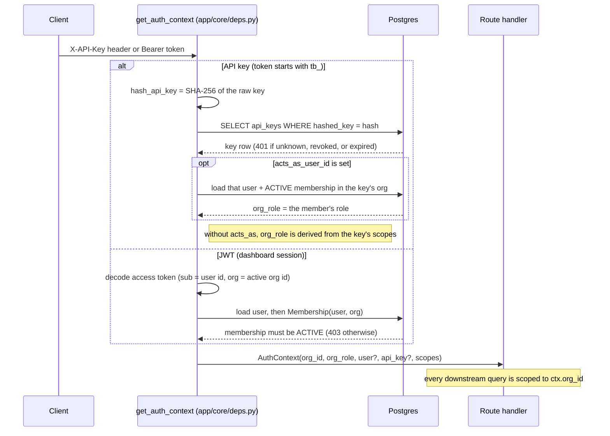
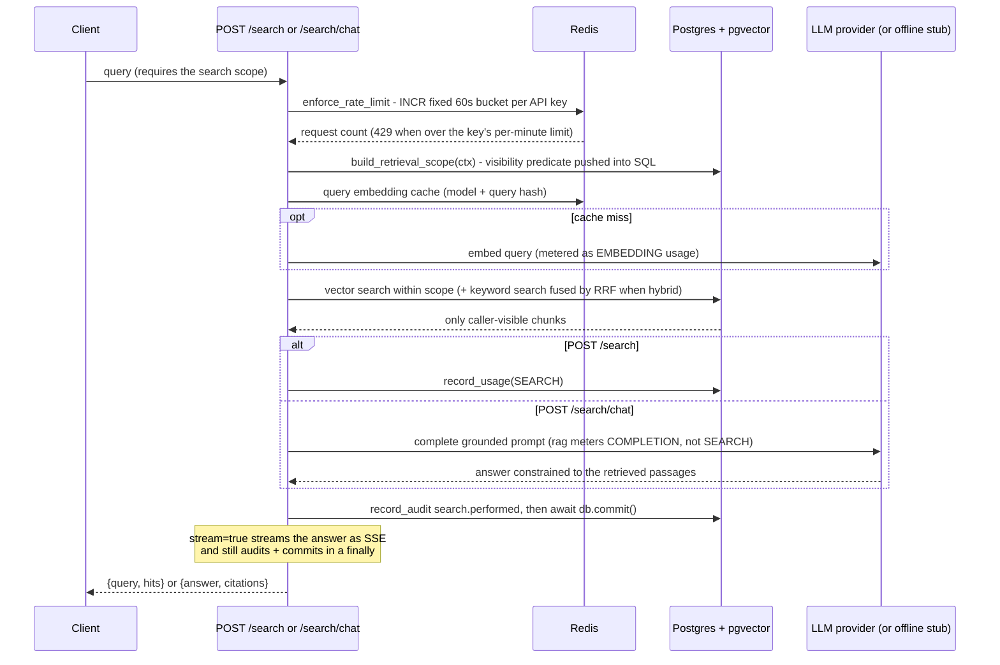

# API Reference

Third Brain exposes three integration surfaces:

- **Native REST API** - `/api/v1/*`, the full product surface (auth, collections,
  documents, search, chat, admin, analytics, knowledge graph).
- **OpenAI-compatible API** - `/v1/*`, so any OpenAI SDK/tool can get grounded,
  permission-filtered answers with no code changes.
- **MCP server** - `/mcp`, so Claude Desktop, Claude Code, Cursor and agents can read the
  brain *and* write documentation back to it as they work. The `third-brain-mcp` CLI connects
  them in one command.

Base URL in these examples is `http://localhost:8000`. Interactive OpenAPI docs are served
at `/docs`, and the raw schema at `/openapi.json`. In production the API is served at
`https://api.third-brain.ai` and the dashboard (web app) at `https://third-brain.ai`.

- [Authentication](#authentication)
- [Conventions](#conventions)
- [Auth endpoints](#auth-endpoints)
- [Users & orgs](#users--organizations)
- [Teams](#teams)
- [API keys](#api-keys)
- [Collections](#collections)
- [Documents](#documents)
- [Search & chat](#search--chat)
- [Connectors](#connectors)
- [Permissions](#permissions)
- [Analytics](#analytics)
- [OpenAI-compatible API](#openai-compatible-api)
- [MCP server](#mcp-server)

---

## Authentication

Two credential types are accepted on the same `AuthContext`:

### JWT (dashboard sessions)

`POST /api/v1/auth/login` returns `{access_token, refresh_token, token_type}`. Send the
access token as a bearer header. Access tokens are short-lived (default 30 min) and carry
the active org; refresh with `POST /api/v1/auth/refresh`.

```bash
curl -H "Authorization: Bearer $ACCESS_TOKEN" http://localhost:8000/api/v1/users/me
```

### API key (programmatic clients, OpenAI-compat, MCP)

Keys start with `tb_`. Send them **either** as a bearer token **or** in the `X-API-Key`
header. A key already carries its organization, so there is no org-switch step.

```bash
export TB_KEY="tb_live_..."
curl -H "Authorization: Bearer $TB_KEY" http://localhost:8000/api/v1/collections
# equivalently:
curl -H "X-API-Key: $TB_KEY"           http://localhost:8000/api/v1/collections
```

Keys carry **scopes** (`read`, `write`, `search`, `ingest`, `manage`, `*`), an optional
expiry, and a per-minute rate limit. Managing keys requires a human **admin** session - a
key cannot mint or revoke keys.

Both credential types resolve to the same request context through a single dependency,
`get_auth_context` in `apps/api/app/core/deps.py`:



### Device authorization (CLI sign-in)

The `third-brain-mcp` CLI signs in with an OAuth-style **device flow** so an engineer never
pastes a raw key: the CLI asks Third Brain for a code, the user approves it in the dashboard,
and a scoped API key is minted once and saved to `~/.third-brain/config.json`. The two
unauthenticated device endpoints (`POST /device-auth` and `/device-auth/token`) are rate
limited; the device code is stored only as a hash, codes expire, and each is single-use.

```bash
# 1. Device starts the flow (unauthenticated). client_name labels the resulting key.
curl -X POST "$TB/api/v1/device-auth" -H 'Content-Type: application/json' \
  -d '{"client_name": "Ada laptop"}'
# -> { "device_code": "…",            # secret the device polls with
#      "user_code": "KTPB-3947",       # short code the human reads aloud / types
#      "verification_uri": "http://localhost:3000/activate",
#      "verification_uri_complete": "http://localhost:3000/activate?code=KTPB-3947",
#      "expires_in": 900, "interval": 7 }

# 2. Device polls until a human approves or the code expires (unauthenticated).
curl -X POST "$TB/api/v1/device-auth/token" -H 'Content-Type: application/json' \
  -d '{"device_code": "…"}'
# -> { "status": "authorization_pending" }   # keep polling every `interval` seconds
#    { "status": "denied" }  |  { "status": "expired" }   # terminal, stop polling
#    { "status": "approved", "api_key": "tb_live_…" }     # returned EXACTLY ONCE
```

The `verification_uri` values above point at the local stack's `/activate` page; in production
they are `https://third-brain.ai/activate` (the `APP_BASE_URL` origin).

Meanwhile an **admin** (a human session, not an API key) approves the code from the dashboard's
`/activate` page, which drives these session endpoints:

```bash
# Look up a pending request by its user code (admin session).
curl -H "Authorization: Bearer $ACCESS_TOKEN" "$TB/api/v1/device-auth/pending/KTPB-3947"

# Approve -> mints the key the device's next poll returns. Optional fields let the admin
# name the key, narrow its scopes, or bind it to another member.
curl -X POST -H "Authorization: Bearer $ACCESS_TOKEN" -H 'Content-Type: application/json' \
  "$TB/api/v1/device-auth/approve" -d '{
    "user_code": "KTPB-3947",
    "name": "Ada laptop",
    "scopes": ["search", "read", "ingest"],
    "acts_as_user_id": null
  }'

# Deny -> the device's next poll returns {"status": "denied"}.
curl -X POST -H "Authorization: Bearer $ACCESS_TOKEN" -H 'Content-Type: application/json' \
  "$TB/api/v1/device-auth/deny" -d '{"user_code": "KTPB-3947"}'
```

Approval is **admin-only**. The minted key defaults to the `search`, `read`, and `ingest`
scopes - enough to search and to let agents write knowledge back - and **acts as the approving
admin** unless the admin binds it to another member with `acts_as_user_id`. That member may not
outrank the approver, so approval can never escalate privilege. The key is subject to the same
scope/ACL rules as any other API key (see [API keys](#api-keys)) and the same secret handling
(shown once, stored only as a hash).

---

## Conventions

- Request/response bodies are JSON (uploads use `multipart/form-data`).
- IDs are UUID strings. Timestamps are ISO-8601 UTC.
- Errors return `{"detail": "..."}` with a conventional status code (`400` validation,
  `401` unauthenticated, `403` forbidden, `404` not found, `429` rate limited).
- List endpoints that paginate return `{items, total, page, page_size}` and accept
  `?page=&page_size=`.
- Every request is scoped to the caller's org; cross-org resources return `404`.

Set a couple of shell variables to follow along:

```bash
export TB=http://localhost:8000
export TB_KEY="tb_live_..."
auth=(-H "Authorization: Bearer $TB_KEY")
```

---

## Auth endpoints

```bash
# Register: creates a user + their first org (as OWNER) and signs in. 201 -> tokens.
curl -X POST "$TB/api/v1/auth/register" -H 'Content-Type: application/json' -d '{
  "email": "you@example.com",
  "password": "supersecret",
  "full_name": "Ada Lovelace",
  "org_name": "Acme Inc"
}'

# Login -> {access_token, refresh_token, token_type}
curl -X POST "$TB/api/v1/auth/login" -H 'Content-Type: application/json' -d '{
  "email": "you@example.com", "password": "supersecret"
}'

# Refresh. Refresh tokens are SINGLE-USE: each call returns a new pair and revokes the
# token you presented. Pass "org_id" to resume your active org (when you still have an
# active membership there); omit it to fall back to your default org.
curl -X POST "$TB/api/v1/auth/refresh" -H 'Content-Type: application/json' -d '{
  "refresh_token": "'"$REFRESH_TOKEN"'"
}'

# Logout -> 204. Optionally pass your refresh token so the server revokes it;
# discard both tokens client-side either way.
curl -X POST "$TB/api/v1/auth/logout" "${auth[@]}" -H 'Content-Type: application/json' \
  -d '{"refresh_token": "'"$REFRESH_TOKEN"'"}'

# Change password (session only, not API keys). Invalidates every existing session
# for the user and returns a fresh token pair minted for this one.
curl -X POST "$TB/api/v1/auth/change-password" -H "Authorization: Bearer $ACCESS_TOKEN" \
  -H 'Content-Type: application/json' \
  -d '{"current_password": "supersecret", "new_password": "evenmoresecret"}'
```

---

## Users & organizations

```bash
# Who am I: the user, every org, the active org and my role in it.
curl "${auth[@]}" "$TB/api/v1/users/me"

# Update my profile
curl -X PATCH "${auth[@]}" -H 'Content-Type: application/json' \
  "$TB/api/v1/users/me" -d '{"full_name": "Ada L."}'

# Orgs
curl "${auth[@]}" "$TB/api/v1/orgs"                      # list my orgs
curl -X POST "${auth[@]}" -H 'Content-Type: application/json' \
  "$TB/api/v1/orgs" -d '{"name": "Side Project"}'        # create
curl -X POST "${auth[@]}" -H 'Content-Type: application/json' \
  "$TB/api/v1/orgs/switch" -d '{"org_id": "<uuid>"}'     # -> new tokens for that org
curl "${auth[@]}" "$TB/api/v1/orgs/current"              # active org
curl -X PATCH "${auth[@]}" -H 'Content-Type: application/json' \
  "$TB/api/v1/orgs/current" -d '{"name": "Acme, Inc."}'

# Members (admin)
curl "${auth[@]}" "$TB/api/v1/orgs/members"
curl -X POST "${auth[@]}" -H 'Content-Type: application/json' \
  "$TB/api/v1/orgs/members/invite" -d '{"email": "teammate@example.com", "role": "editor"}'
curl -X PATCH "${auth[@]}" -H 'Content-Type: application/json' \
  "$TB/api/v1/orgs/members/<membership_id>" -d '{"role": "admin"}'
curl -X DELETE "${auth[@]}" "$TB/api/v1/orgs/members/<membership_id>"

# Reset a member's password (admin session only) -> {"temporary_password": "..."} shown
# ONCE. Kills all of the member's sessions. Guard rails: 400 on self (use
# change-password), owners can only be reset by owners (403), and 409 when the user
# also belongs to another org (they must reset from their own account or via support).
curl -X POST -H "Authorization: Bearer $ACCESS_TOKEN" \
  "$TB/api/v1/orgs/members/<membership_id>/reset-password"
```

`org_role` is one of `owner`, `admin`, `editor`, `viewer`.

---

## Teams

Teams group users for permissioning (see [PERMISSIONS.md](./PERMISSIONS.md)).

```bash
curl "${auth[@]}" "$TB/api/v1/teams"                                      # list
curl -X POST "${auth[@]}" -H 'Content-Type: application/json' \
  "$TB/api/v1/teams" -d '{"name": "SRE", "description": "On-call + infra"}'
curl "${auth[@]}" "$TB/api/v1/teams/<team_id>"                            # detail (+members)
curl -X PATCH "${auth[@]}" -H 'Content-Type: application/json' \
  "$TB/api/v1/teams/<team_id>" -d '{"description": "Reliability"}'
curl -X DELETE "${auth[@]}" "$TB/api/v1/teams/<team_id>"
curl -X POST "${auth[@]}" -H 'Content-Type: application/json' \
  "$TB/api/v1/teams/<team_id>/members" -d '{"user_id": "<uuid>"}'
curl -X DELETE "${auth[@]}" "$TB/api/v1/teams/<team_id>/members/<user_id>"
```

---

## API keys

Requires an **admin user session** (not an API key).

```bash
# List
curl -H "Authorization: Bearer $ACCESS_TOKEN" "$TB/api/v1/api-keys"

# Create -> {api_key: {...}, secret: "tb_live_..."}  (secret shown ONCE)
curl -X POST -H "Authorization: Bearer $ACCESS_TOKEN" -H 'Content-Type: application/json' \
  "$TB/api/v1/api-keys" -d '{
    "name": "ci-bot",
    "scopes": ["search", "read"],
    "rate_limit_per_minute": 60,
    "expires_at": "2027-01-01T00:00:00Z",
    "acts_as_user_id": null
  }'

# Revoke (keeps history) / delete
curl -X POST   -H "Authorization: Bearer $ACCESS_TOKEN" "$TB/api/v1/api-keys/<id>/revoke"
curl -X DELETE -H "Authorization: Bearer $ACCESS_TOKEN" "$TB/api/v1/api-keys/<id>"
```

Bind a key to a member with `acts_as_user_id` to give it that user's exact ACL view.

---

## Collections

A collection is a knowledge base. Lists are permission-filtered.

```bash
# List (only collections you can view)
curl "${auth[@]}" "$TB/api/v1/collections"

# Create
curl -X POST "${auth[@]}" -H 'Content-Type: application/json' \
  "$TB/api/v1/collections" -d '{
    "name": "Company Handbook",
    "description": "Policies and onboarding",
    "visibility": "org",
    "default_permission": "viewer"
  }'

curl "${auth[@]}" "$TB/api/v1/collections/<id>"        # detail (+your effective permission)
curl -X PATCH "${auth[@]}" -H 'Content-Type: application/json' \
  "$TB/api/v1/collections/<id>" -d '{"visibility": "team"}'
curl -X DELETE "${auth[@]}" "$TB/api/v1/collections/<id>"
```

`visibility` ∈ `private|team|org|public`; `default_permission` ∈ `none|viewer|editor|manager`.

---

## Documents

Documents are ingested asynchronously: creation returns immediately with
`status: "pending"`, and a worker runs extract → chunk → embed → index, moving through
`processing` → `indexed` (or `failed`). Content that appears to contain secrets is
parked at `quarantined` for human review instead of being indexed (see
[SECURITY.md](./SECURITY.md#secret-scanning--quarantine)). Poll `GET /documents/{id}`
for status.

Every list item carries a `via` field: it is `"mcp"` when an agent wrote the document
through the MCP `add_knowledge` tool, and `null` otherwise. Filter to agent-written
documentation with `?via=mcp` (this is what the dashboard's "Written by agents" view uses).
Agent-written documents also carry a `doc_type` field when the agent categorized the
capture (`decision`, `solution`, `answer`, `note`, or `reference`); it is `null` otherwise.

```bash
# List (paginated, filterable). Add &via=mcp to show only agent-written documents.
curl "${auth[@]}" "$TB/api/v1/documents?collection_id=<id>&status=indexed&q=vacation&page=1&page_size=20"

# From text / markdown
curl -X POST "${auth[@]}" -H 'Content-Type: application/json' \
  "$TB/api/v1/documents/text" -d '{
    "collection_id": "<id>",
    "title": "PTO Policy",
    "content": "# Paid Time Off\nNew hires accrue 15 days...",
    "visibility": null
  }'

# From a URL
curl -X POST "${auth[@]}" -H 'Content-Type: application/json' \
  "$TB/api/v1/documents/url" -d '{"collection_id": "<id>", "url": "https://example.com/policy"}'

# From a file upload (PDF, DOCX, MD, HTML, TXT, CSV, or an image)
curl -X POST "${auth[@]}" \
  -F "collection_id=<id>" \
  -F "file=@handbook.pdf" \
  "$TB/api/v1/documents/upload"

# Images (PNG/JPEG/GIF/WebP) are described by a vision model at ingestion: the indexed
# chunk is a summary + transcribed text, ending in a capability URL that serves the
# original bytes so an LLM can fetch the image itself. That URL is also returned as
# `image_url` on the document. It carries an unguessable token instead of auth headers
# (which LLM fetch tools cannot attach); anyone able to read the chunk was already
# permitted to see the image. Set PUBLIC_API_URL so the baked links use your real origin.
curl "$TB/api/v1/files/<token>"        # no auth header; 404s for anything but raster bytes

# Full source text (for the dashboard editor) and save-and-re-index.
# GET requires viewer; `editable` reflects THIS caller's permission and is false for
# images (whose content is the generated description). 409 when quarantined.
curl "${auth[@]}" "$TB/api/v1/documents/<id>/content"
# PUT requires editor + a write/ingest scope. The new content is secret/DLP-scanned
# BEFORE any mutation (422 leaves the document untouched), then re-chunked and
# re-embedded inline; saving clears any prior verification and converts a non-text
# source to plain text. 409 for image documents.
curl -X PUT "${auth[@]}" -H "Content-Type: application/json" \
  -d '{"content":"# Updated\n\nNew body."}' \
  "$TB/api/v1/documents/<id>/content"

# Detail / chunks / reprocess / delete
curl "${auth[@]}" "$TB/api/v1/documents/<id>"
curl "${auth[@]}" "$TB/api/v1/documents/<id>/chunks"
curl -X POST   "${auth[@]}" "$TB/api/v1/documents/<id>/reprocess"   # 409 if quarantined
curl -X DELETE "${auth[@]}" "$TB/api/v1/documents/<id>"

# Quarantine (documents flagged by the secret scanner; both require editor and 409
# unless status is "quarantined"; discard = the normal DELETE above)
# Review -> {document {..., visibility}, findings (redacted samples), scanned_at,
#            truncated, collection,
#            audience: {total_users, truncated, note,
#                       permission_counts: {viewer, editor, manager}, entries}}
#   The audience is document-visibility aware and includes document-level grants.
#   entries (names + emails) are populated only for collection managers / org admins;
#   other editors get [] plus permission_counts and a note.
curl "${auth[@]}" "$TB/api/v1/documents/<id>/review"
# Approve ("index anyway"): stamps a checksum-keyed approval and re-queues ingestion.
curl -X POST "${auth[@]}" "$TB/api/v1/documents/<id>/approve"
```

Authorization has two layers for API-key callers. **ACLs**: uploading/creating/deleting a
document requires `editor`+ on the target collection. **Key scopes** (enforced on top of
ACLs): a key must carry a `write` or `ingest` scope to create/modify/delete documents, and a
`read`, `search`, `write`, `ingest` or `manage` scope to read them - so a search-only key can
never write, and a scopeless key can neither read nor write. Human (JWT) sessions are unscoped
and act with their org role.

---

## Search & chat

Both are **permission-aware**: results are restricted to chunks the caller may view, so a
document you can't see can never appear in a hit or a citation.

Both endpoints run the same pipeline (`apps/api/app/api/routes/search.py`); chat adds a
grounded LLM completion on top of retrieval:



### Search (retrieval only)

```bash
curl -X POST "${auth[@]}" -H 'Content-Type: application/json' \
  "$TB/api/v1/search" -d '{
    "query": "how many vacation days do new hires get?",
    "collection_ids": null,
    "top_k": 5,
    "hybrid": true
  }'
```

Response:

```json
{
  "query": "how many vacation days do new hires get?",
  "hits": [
    {
      "document_id": "…", "document_title": "PTO Policy",
      "collection_id": "…", "chunk_index": 0,
      "score": 0.83, "snippet": "New hires accrue 15 days…"
    }
  ]
}
```

`hybrid: true` fuses vector + keyword (BM25-style) results via Reciprocal Rank Fusion. Omit
`top_k` to use the server default (`RETRIEVAL_TOP_K`).

### Chat (retrieval-augmented generation)

```bash
# Non-streaming -> {answer, citations}
curl -X POST "${auth[@]}" -H 'Content-Type: application/json' \
  "$TB/api/v1/search/chat" -d '{
    "query": "Summarize our PTO policy for a new hire.",
    "collection_ids": null,
    "top_k": 8,
    "model": null,
    "stream": false
  }'
```

```json
{
  "answer": "New hires accrue 15 days of PTO per year…",
  "citations": [ { "document_title": "PTO Policy", "chunk_index": 0, "score": 0.83, "...": "..." } ]
}
```

Streaming (`"stream": true`) returns `text/event-stream`. Each event is a `data:` line
carrying a JSON frame: `{"type":"token","text":"…"}` for each answer delta, then a single
`{"type":"citations","citations":[…]}` frame, and finally `data: [DONE]`. Concatenate the
`token` frames to reconstruct the answer; the `citations` frame carries the sources:

```bash
curl -N -X POST "${auth[@]}" -H 'Content-Type: application/json' \
  "$TB/api/v1/search/chat" -d '{"query": "TL;DR the onboarding guide", "stream": true}'
```

```text
data: {"type": "token", "text": "New "}
data: {"type": "token", "text": "hires "}
data: {"type": "citations", "citations": [{"document_title": "PTO Policy", "score": 0.83, "...": "..."}]}
data: [DONE]
```

The OpenAI-compatible `/v1/chat/completions` endpoint instead uses OpenAI's own
`chat.completion.chunk` SSE shape (with a `citations` field on the terminal chunk).

`model` selects the completion model: the product alias `third-brain` (or an omitted
`model`) resolves to `DEFAULT_COMPLETION_MODEL`; any other id (e.g. a connector's) is passed
through to the provider.

---

## Connectors

Connectors bind your org to a specific provider endpoint for a purpose. Credentials
are encrypted at rest and never returned. Reads are open to members; mutations require
**admin**. `purpose` is `embedding` or `completion`. Reranking is not yet implemented,
and there is no `rerank` purpose value; posting one is rejected with `422` (see
[ROADMAP.md](./ROADMAP.md)).

```bash
curl "${auth[@]}" "$TB/api/v1/connectors"

curl -X POST "${auth[@]}" -H 'Content-Type: application/json' \
  "$TB/api/v1/connectors" -d '{
    "name": "Prod OpenAI",
    "type": "openai",
    "purpose": "completion",
    "model": "gpt-4o-mini",
    "config": {},
    "credentials": {"api_key": "sk-..."}
  }'

curl -X PATCH  "${auth[@]}" -H 'Content-Type: application/json' \
  "$TB/api/v1/connectors/<id>" -d '{"model": "gpt-4o"}'
curl -X DELETE "${auth[@]}" "$TB/api/v1/connectors/<id>"

# Live round-trip test -> {ok, message, latency_ms}
curl -X POST "${auth[@]}" "$TB/api/v1/connectors/<id>/test"
```

`type` ∈ `openai|azure_openai|anthropic|google|ollama|custom` (the dashboard labels
`anthropic` **Anthropic** and `google` **Google Gemini**). These no longer all speak one wire
format: a single LLM layer (`app/services/llm/`, plain `httpx`, no provider SDKs) adapts each
provider's native REST protocol behind one interface. `openai`, `azure_openai`, `ollama`, and
`custom` speak the OpenAI-compatible API (`custom` = any other OpenAI-compatible endpoint via
`config.base_url`); `anthropic` and `google` speak their own. **Anthropic is completions-only**
- it has no embeddings API, so posting an `anthropic` connector with `purpose: "embedding"` is
rejected; Google Gemini does both (embeddings via `gemini-embedding-001` at the configured
`EMBEDDING_DIM`).

---

## Permissions

Manage `access_grants` and inspect effective permission. See
[PERMISSIONS.md](./PERMISSIONS.md).

```bash
# List grants on a resource (+ resolved principal_name)
curl "${auth[@]}" "$TB/api/v1/permissions?resource_type=collection&resource_id=<id>"

# Grant a team editor on a collection
curl -X POST "${auth[@]}" -H 'Content-Type: application/json' \
  "$TB/api/v1/permissions" -d '{
    "resource_type": "collection",
    "resource_id": "<id>",
    "principal_type": "team",
    "principal_id": "<team_id>",
    "permission": "editor"
  }'

curl -X DELETE "${auth[@]}" "$TB/api/v1/permissions/<grant_id>"

# My effective permission on a resource -> {"permission": "viewer"}
curl "${auth[@]}" "$TB/api/v1/permissions/effective?resource_type=document&resource_id=<id>"
```

---

## Analytics

```bash
# Headline KPIs
curl "${auth[@]}" "$TB/api/v1/analytics/overview"
# -> {documents, collections, members, api_keys, searches_7d, tokens_30d, cost_30d}

# Usage time-series (gap-free by_day + by_kind breakdown)
curl "${auth[@]}" "$TB/api/v1/analytics/usage?days=30"

# Audit log (admin only, paginated, newest first)
curl "${auth[@]}" "$TB/api/v1/analytics/audit?page=1&page_size=20"
```

---

## Knowledge graph

Permission-aware similarity graph powering the dashboard's graph view. Both routes require
the `search` scope and return only chunks/documents the caller may view.

```bash
# Similarity graph of the caller's visible documents (nodes + weighted edges).
# Query params: collection_id (optional), limit (default 400, max 1000),
# min_similarity (0-1), max_neighbors (per-node edge cap).
curl "${auth[@]}" "$TB/api/v1/graph?limit=400&min_similarity=0.2"
# -> GraphResponse { nodes: [...], edges: [{source, target, weight}] }

# One document's nearest visible neighbors (404 if the document isn't visible).
curl "${auth[@]}" "$TB/api/v1/graph/documents/<id>/neighbors?limit=12"
# -> GraphNeighbors { document_id, neighbors: [{document_id, title, similarity}] }
```

---

## OpenAI-compatible API

Mounted at the **root** `/v1` (not `/api/v1`). Point any OpenAI SDK at
`http://localhost:8000/v1` and use your Third Brain **API key** as the OpenAI key. Chat
completions are grounded in your knowledge base and permission-filtered.

Use the product model id **`third-brain`** (listed by `GET /v1/models`) - it resolves to
your org's configured completion model, so it keeps working whether you run the offline stub
or a real provider. A concrete model id also works, but it is sent to your org's configured
provider, so it must be a model that provider serves (for example a `claude-*` id on an
Anthropic connector, or a `gemini-*` id on a Google connector) - not an arbitrary passthrough.

```bash
# Chat completions
curl -X POST "$TB/v1/chat/completions" \
  -H "Authorization: Bearer $TB_KEY" -H 'Content-Type: application/json' -d '{
    "model": "third-brain",
    "messages": [{"role": "user", "content": "What is our refund policy?"}]
  }'

# Embeddings
curl -X POST "$TB/v1/embeddings" \
  -H "Authorization: Bearer $TB_KEY" -H 'Content-Type: application/json' -d '{
    "model": "text-embedding-3-small",
    "input": ["hello world"]
  }'

# Models
curl -H "Authorization: Bearer $TB_KEY" "$TB/v1/models"
```

With the official OpenAI Python SDK:

```python
from openai import OpenAI

client = OpenAI(base_url="http://localhost:8000/v1", api_key="tb_live_...")
resp = client.chat.completions.create(
    model="third-brain",
    messages=[{"role": "user", "content": "Summarize our onboarding guide."}],
)
print(resp.choices[0].message.content)
```

`stream=true` is supported and streams standard OpenAI SSE `data:` chunks. Because
retrieval is permission-aware, the model only ever grounds on chunks your key can see.

---

## MCP server

Third Brain ships a [Model Context Protocol](https://modelcontextprotocol.io) server at
`/mcp`. It is how agents **write documentation as they work**: Claude Desktop, Claude Code,
Cursor, and custom agents connect natively and can both **read** the brain and **write** to it,
capturing decisions and answers into the right collection without anyone stopping to author a
doc. All MCP calls authenticate with an API key and respect the same ACLs.

Tools exposed:

| Tool | Purpose |
|---|---|
| `search_knowledge` | Permission-aware semantic search; returns citations. |
| `get_document` | Fetch a document's content/metadata (if you may view it). |
| `list_collections` | List the knowledge bases you can view. |
| `add_knowledge` | Capture a document into the brain; the target collection is optional (requires `ingest`/`write`). |
| `update_knowledge` | Update existing document content. |

`add_knowledge` and `update_knowledge` are the write-back path. They pass through the same
secret/DLP scanner as any upload: content flagged by the secret scanner (or by the DLP scanner
when the deployment's `DLP_DEFAULT_ACTION` is `quarantine`) persists as `quarantined` and tells
the model why; under the default `label` action, DLP-only hits are indexed with a sensitivity
label instead. A flagged `update_knowledge` is rejected outright. The same permission model
gates *where* an agent may write (editor on the collection, plus an `ingest`/`write` key scope).

`add_knowledge`'s `collection` argument is **optional** - agents capturing proactively can omit
it and Third Brain files the document automatically:

- With exactly one editable collection, the capture lands there (no model call is made).
- With several, the org's completion model picks the best match from the collections' names and
  descriptions; if it abstains (or no provider is configured), the capture falls back to an
  editable "Decisions" collection, then the most-populated editable one.
- With none, Third Brain creates a shared, org-visible and org-writable **Decisions**
  collection (once per org) to hold agent captures. Like `POST /collections`, creating it
  requires an org role of editor or higher, and the creation is recorded in the audit log.

Content is scanned **before** routing: a capture that trips either scanner is never included
in the routing model's prompt - routing falls back to the deterministic rules above, and the
scanners' usual outcome (quarantine or sensitivity label, as above) still applies to the
document itself. The response reports `auto_routed: true` when
Third Brain chose the collection, and an optional `doc_type` argument (`decision`, `solution`,
`answer`, `note`, `reference`) categorizes the capture (surfaced as the document's `doc_type`
field in the REST API).

### Connect with the CLI (recommended)

The `third-brain-mcp` CLI wires the brain into your tools in one command - no config files to
hand-edit:

```bash
npx third-brain-mcp connect          # device-code sign-in (see Device authorization above)
npx third-brain-mcp install claude   # writes the Claude Desktop config (also: cursor, claude-code)
npx third-brain-mcp status           # sanity-check the saved connection
```

`install claude` and `install cursor` write the client config for you; `install claude-code`
prints the `claude mcp add` one-liner to paste. Under the hood these point the client at
`npx third-brain-mcp serve`, the stdio-to-HTTP bridge that relays the client's MCP traffic to
`POST /mcp` with your saved key. Once connected, ask your assistant to *"write up the decision we
just made into Engineering / Decisions"* or *"search the company brain for the on-call runbook"* -
every call is scoped to what the key's principal is allowed to see and do.

### Manual configuration (clients the CLI doesn't cover)

The endpoint is a single JSON-RPC 2.0 surface at `POST /mcp` using the MCP **streamable-HTTP**
message format - there is no separate SSE stream to open. Authenticate with an API key via the
`Authorization: Bearer` header (or `X-API-Key`). A client that speaks MCP over HTTP directly can
be pointed straight at it:

```json
{
  "mcpServers": {
    "third-brain": {
      "url": "http://localhost:8000/mcp",
      "headers": { "Authorization": "Bearer tb_live_..." }
    }
  }
}
```

For a stdio-only desktop client, run the bridge as the server command instead (this is exactly
what `third-brain-mcp install` writes):

```json
{
  "mcpServers": {
    "third-brain": {
      "command": "npx",
      "args": ["-y", "third-brain-mcp", "serve"]
    }
  }
}
```
