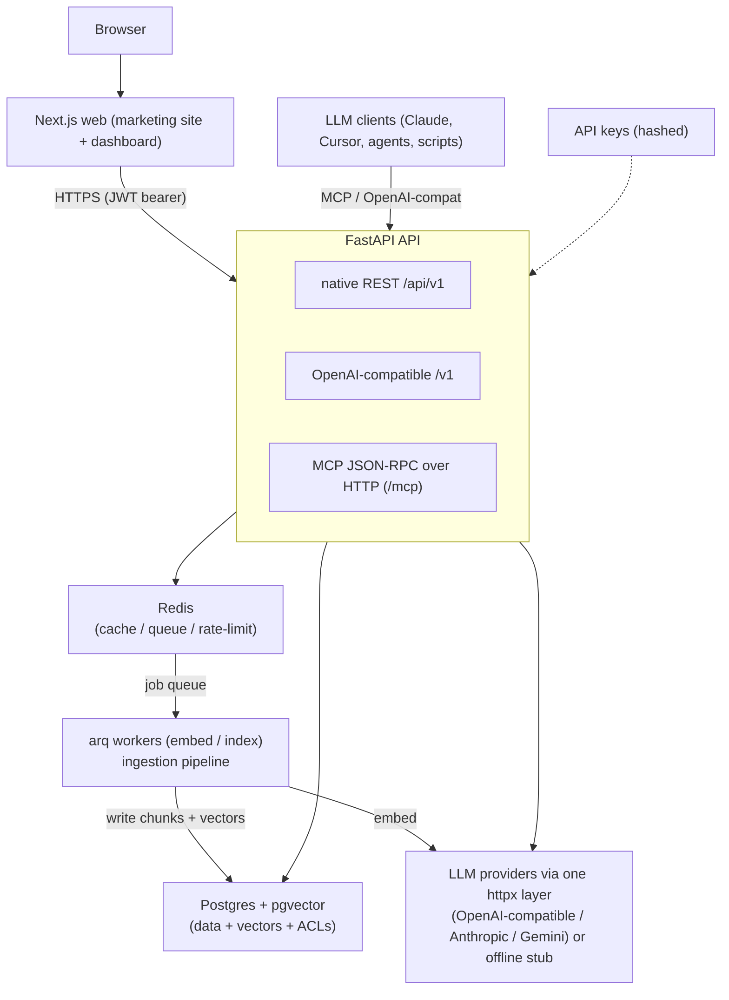
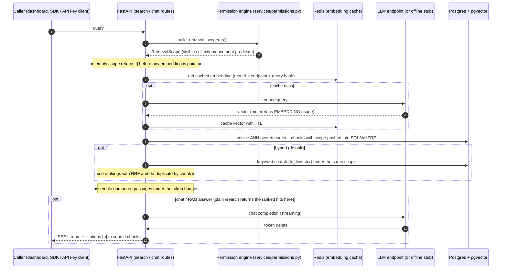
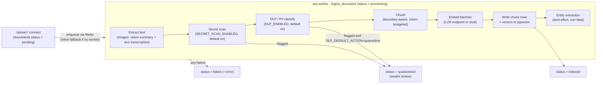

# Third Brain - Architecture

## 1. The problem

Company knowledge is scattered across wikis, drives, tickets, chat and people. Every new
LLM tool re-implements retrieval and has no shared notion of *who is allowed to see what*.
Third Brain is the single, governed knowledge layer that every LLM plugs into - read
**and** write - with permissions enforced at retrieval time.

## 2. High-level topology



## 3. Core domain model

Almost every row is scoped to an `organization` (multi-tenant); `users` is the one global
identity table. Primary keys are UUIDs.

| Entity | Purpose |
|---|---|
| `organizations` | Tenant boundary; everything else hangs off it |
| `users` | Global identity (email + password) |
| `memberships` | User ↔ Org with an org **role** (owner/admin/editor/viewer) |
| `teams` / `team_members` | Groups for permissioning |
| `api_keys` | Hashed programmatic credentials with scopes + rate limits |
| `collections` | A knowledge base: default visibility + embedding config |
| `documents` | A source doc (file/url/text/image); status = pending → processing → indexed \| quarantined \| failed |
| `document_chunks` | Text chunk + `vector` embedding (the searchable unit) |
| `access_grants` | ACL: (resource, principal, permission_level) |
| `connectors` | Per-org LLM provider endpoint config for embeddings/completions |
| `usage_records` | Per-call tokens/cost/latency for analytics + usage metering |
| `audit_logs` | Immutable record of security-relevant actions |
| `data_sources` / `external_identities` / `document_external_principals` | Knowledge connectors: synced documents plus the source system's ACL, mapped to users/teams and materialized into `access_grants` |
| `entities` / `document_entities` | Named entities extracted at ingestion + the documents that mention them |
| `answers` | Curated Q&A with a verification status; verified ones surface above raw hits |
| `conversations` / `conversation_messages` | Assistant chat history that grounds follow-up questions |
| `query_insights` | Per-query signals + ratings behind the knowledge-gap report |
| `invites` | Pending email invitations (token stored hashed) |
| `sso_connections` / `federated_identities` / `scim_tokens` | OIDC/SAML config, IdP subject mapping, SCIM provisioning tokens |
| `device_authorizations` | CLI device-code sign-ins awaiting browser approval (org bound on approval) |

## 4. Permission model (the heart of the product)

Access is resolved as the **maximum** grant reachable by a principal:

```
effective_permission(user, resource) =
    max(
        role_baseline(user.org_role),                       # org owners/admins see all
        ownership,                                          # collection.owner_id == user => MANAGER
        collection.default_permission if visibility allows, # PRIVATE/TEAM/ORG/PUBLIC visibility
        direct user grant on resource,                      # access_grants (principal=user)
        best team grant on resource for user's teams,       # access_grants (principal=team)
        inherited grant from the parent collection          # doc inherits collection grant
    )
```

Levels: `NONE < VIEWER < EDITOR < MANAGER`. Enforcement happens in **two** places that
must never disagree:

1. **API authorization** - every route checks the caller's effective permission.
2. **Retrieval filtering** - semantic search joins `document_chunks` against the set of
   `collection_id`/`document_id` the caller can *view*, computed once per request and
   pushed **into the SQL `WHERE` clause**. A chunk you cannot see can never enter a
   prompt, even indirectly.

`services/permissions.py` is the single source of truth; both call sites use it.

## 5. Retrieval pipeline (RAG)



1. **Authorize** - compute the caller's visible `collection_id`/`document_id` set.
2. **Embed** the query (cached in Redis, keyed by model + endpoint + text hash).
3. **Vector search** - pgvector cosine ANN over `document_chunks`, filtered by the
   visible-id set and requested collections.
4. **Hybrid** - optional keyword (`tsvector`) search fused with vector results (RRF).
5. **Assemble** context with citations and token budget.
6. **Generate** (for `/chat` and OpenAI-compatible endpoints) via the LLM layer, streaming,
   returning inline citations to the source chunks.

> A reranking stage over the shortlist is **planned, not yet implemented** - see
> [`ROADMAP.md`](./ROADMAP.md).

## 6. Ingestion pipeline (write path)

`upload/connect → extract → scan (secrets, DLP) → chunk → embed → index → enrich`



- Accepts files (PDF, DOCX, MD, HTML, TXT, CSV/TSV, or a raster image), raw text, or URLs.
  Images take a separate path: a vision model produces the indexed text (summary + transcribed
  text), ending in a capability URL that serves the original bytes.
- Extraction normalizes to text + structural metadata.
- Chunking is token-aware **and boundary-aware**: a chunk closes at the strongest nearby
  boundary (heading > paragraph > sentence) once `CHUNK_TARGET_TOKENS` is reached, and is
  force-closed at the `CHUNK_SIZE_TOKENS` ceiling. Natural chunks carry **no overlap**;
  `CHUNK_OVERLAP_TOKENS` applies only to the fallback windowing of a single sentence that alone
  exceeds the ceiling. Each chunk keeps a stable `chunk_index`.
- Embedding + indexing run in **arq workers** so uploads return immediately; `documents.status`
  transitions `pending → processing → indexed | quarantined | failed`. A `quarantined` document
  (secret scanner, or DLP where the deployment quarantines) leaves that state only through review:
  approving it stamps a checksum-keyed approval and re-queues it as `pending`, or it is deleted
  (see [`SECURITY.md`](./SECURITY.md)).
- Re-ingestion (`reprocess`) atomically replaces a document's prior chunks under a per-document
  advisory lock, so a re-run never leaves duplicate or partial chunk sets. A SHA-256 `checksum` of
  the source bytes is stored for change detection and integrity (not yet used to skip unchanged
  re-embeds).

## 7. LLM layer (multi-provider, one httpx client)

`services/llm/` reaches every provider through **per-provider wire adapters over one shared
`httpx` client - no third-party SDKs**. Each adapter maps a provider's native REST protocol
(request shape, auth header, streaming frames) onto one internal interface for embeddings and
chat completions, sync and streaming. Supported provider types
(mirrored by **Connectors**): `openai`, `azure_openai`, `ollama`, and `custom` speak the
OpenAI-compatible API (`custom` = any other compatible endpoint via `config.base_url`);
`anthropic` and `google` (labelled Anthropic and Google Gemini) speak their own. **Anthropic is
completions-only** - it exposes no embeddings API, so an `anthropic` embedding connector is
rejected; **Gemini** does both (embeddings via `gemini-embedding-001` at the configured
`EMBEDDING_DIM`).

Platform-wide default keys come from the environment - `OPENAI_API_KEY`, `ANTHROPIC_API_KEY`,
`GOOGLE_API_KEY` - resolved by priority (`openai > anthropic > google` for completions,
`openai > google` for embeddings); per-org **Connectors** override them, including
private/self-hosted endpoints. With no key configured at all, a deterministic **offline stub** runs
the whole pipeline (embeddings + answers) so dev/CI/demo work with zero keys.

## 8. Integration surfaces ("any LLM can connect")

- **Native REST** - `/api/v1/...` full CRUD + `/search` + `/chat`.
- **OpenAI-compatible** - `/v1/chat/completions` and `/v1/embeddings`, so any OpenAI SDK
  or tool can point at Third Brain and get **grounded, permission-filtered** answers.
- **MCP server** - `app/mcp/` exposes `search_knowledge`, `get_document`, `list_collections`,
  `add_knowledge` and `update_knowledge`, so Claude Desktop / Claude Code / Cursor / agents
  connect natively and both read the brain and **write documentation back to it** as they work.
  `add_knowledge` / `update_knowledge` are the write path, gated by the secret scanner and ACLs.
  The `third-brain-mcp` CLI wires clients in with one command (`connect` + `install`) and runs
  the stdio-to-HTTP `serve` bridge to the JSON-RPC `POST /mcp` endpoint. Every MCP call
  authenticates with an API key and respects ACLs.

## 9. Caching & performance

- Redis caches query embeddings.
- pgvector HNSW index on `document_chunks.embedding` for ANN.
- Rate limiting per API key in Redis (fixed 60-second window).
- Workers decouple slow embedding from request latency.

## 10. Observability

- Structured logging (structlog): JSON in production, console in dev; every line carries
  `request_id`, and `org_id`/`user_id`/`job_id`/`trace_id` where bound.
- OpenTelemetry tracing, opt-in via `OTEL_EXPORTER_OTLP_ENDPOINT` (vendor-neutral OTLP):
  auto-instrumented FastAPI/SQLAlchemy/httpx/Redis plus gen_ai LLM spans, retrieval and
  ingestion stage spans, with trace context propagated across the arq queue boundary.

See [`OBSERVABILITY.md`](./OBSERVABILITY.md) for the full design and debugging recipes.

## 11. Security

- Passwords hashed with bcrypt; API keys stored only as SHA-256 hashes (prefix shown once).
- JWT access/refresh tokens; short-lived access tokens.
- Per-org data isolation enforced in every query.
- Audit log for auth, permission changes, key lifecycle and document access.
- Secrets for connectors encrypted at rest (Fernet) using `SECRET_KEY`.

See [`SECURITY.md`](./SECURITY.md) for the threat model and disclosure policy.
