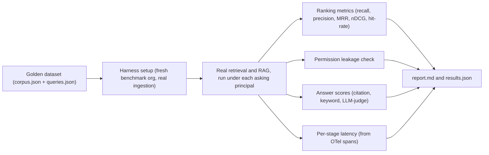

# Third Brain - Benchmarking

How to measure whether the answers are any good: run a labeled golden dataset through the
real retrieval, RAG and permission pipeline, then get scored numbers for retrieval quality,
answer quality, and permission correctness, plus single-request latency broken down by
stage.

## 1. Why this exists

[`docs/LOAD_TESTING.md`](LOAD_TESTING.md) answers "does the platform hold up under load" -
latency, throughput and error rate at millions of chunks. It says nothing about whether a search
returned the *right* chunks, and a system can be fast and confidently wrong.

This harness answers the other half. Given a query whose correct answer we already know: does
permission-scoped retrieval surface the document that answers it, near the top? Does the generated
answer cite the right sources and state the key facts? And, most important, does a principal ever
retrieve a document they were never allowed to see? Those questions need labeled ground truth, not
synthetic traffic.

The harness lives in `apps/api/benchmarks/` and never reimplements retrieval, permissions or
ingestion: it calls the same services the product uses, so the numbers describe the real system.

## 2. What the harness does

The harness materializes a small labeled world into a fresh, throwaway `benchmark-*`
organization and drives real queries through it under each principal's identity.



**The golden dataset** (`apps/api/benchmarks/golden/`) is a self-consistent company: teams,
collections with a mix of visibilities (org-wide, team-restricted, private), principals with
org roles plus team memberships and explicit ACL grants, documents, and natural-language
queries. Every query is labeled with the documents that genuinely answer it, and every
principal declares the collections they are entitled to read. Some queries are
*permission-critical*: the document that answers them lives in a collection the asking
principal cannot see, so the correct behavior is to retrieve nothing rather than leak it.

**The harness** (`benchmarks/harness.py`) creates the org, teams, collections, users,
memberships and grants, then ingests every document through the real ingestion service, so
chunking and embedding are exactly what production does. For each (query, retrieval-config)
pair it builds the querying principal's auth context and calls the real
`app.services.retrieval.retrieve` (and, with answers on, `app.services.rag.answer`). It
never passes a collection filter, so the only thing that can exclude a chunk is the real
permission engine. That is what makes the leakage check meaningful.

**The metrics** (`benchmarks/metrics.py`) score the ranked results against the labels. All
operate on a ranked list of doc ids with rank 0 as the top hit:

- **recall@k** - of the documents that truly answer a query, what fraction made the top k.
- **precision@k** - of the top k retrieved, what fraction are relevant.
- **hit-rate@k** - 1.0 if any relevant document is in the top k, else 0.0 (averaged, this is
  the share of queries where retrieval found *something* right).
- **MRR** - mean reciprocal rank, `1 / (rank + 1)` of the first relevant hit. Near 1.0 means
  the right document is usually rank 0.
- **nDCG@k** - rank-discounted quality with binary gains and a log2 discount, rewarding
  relevant documents placed high.

**Permission correctness** is scored separately and is not a ranking metric: for every run
the harness compares the retrieved documents against the asker's ground-truth visible set
and counts any that fall outside it. That count is *leakage*, and it must be exactly zero.

**Answer scores** (`benchmarks/judge.py`) grade the generated answers when answers are on:

- **citation precision / recall** - of the sources the answer cited, what fraction are
  relevant; and of the relevant documents, what fraction were cited.
- **keyword coverage** - the fraction of a query's reference key facts that appear in the
  answer text (an offline correctness proxy that needs no model).
- **LLM-judge faithfulness / correctness** - a 0..1 score for whether the answer is grounded
  in the retrieved context and whether it matches the reference answer. These run only with a
  live provider (see below).

**Per-stage latency** (`benchmarks/perf.py`) reports the median duration of each pipeline
stage for one request, read from the OpenTelemetry spans the services already emit
(`retrieval.scope`, `retrieval.embed_query`, `retrieval.vector_search`,
`retrieval.keyword_search`, `retrieval.retrieve`, `rag.answer`). It reuses the observability
instrumentation rather than adding timing to the services. Unlike load testing, this is a
single-request breakdown for "where does one query spend its time", not a throughput number.

## 3. Offline versus live

The harness reports which provider backed a run; it never silently mixes them. The mode
follows the same decision the LLM layer makes for an org with no connector.

- **Offline** (the default, zero keys). The deterministic offline stub produces
  bag-of-words-ish embeddings, so lexical and hybrid retrieval carry real signal and the
  ranking metrics are meaningful. Permission, citation and keyword numbers are *fully real* -
  the permission engine, the ingestion pipeline and the citation plumbing are the production
  code either way. What offline cannot measure is true semantic retrieval, and the LLM-judge
  is skipped because there is no provider to judge with (`llm_faithful` / `llm_correct` are
  reported as absent).
- **Live** (set a provider key. `OPENAI_API_KEY` or `GOOGLE_API_KEY` give real embeddings *and*
  answers; `ANTHROPIC_API_KEY` gives real answers only, since Anthropic has no embeddings API, so
  embeddings stay on the stub. Add `OPENAI_BASE_URL` for Azure/Ollama/vLLM/any OpenAI-compatible
  gateway.) Embeddings and answers then come from the real provider, so retrieval quality reflects
  genuine semantic search and the LLM-judge scores faithfulness and correctness. Provider latency
  now appears in `rag.answer` and the totals.

Read every report with its `provider_mode` in mind. A strong offline recall number is
evidence the lexical path and permissions work; it is not evidence about semantic quality.

## 4. How to run it

```bash
# 1. Install the API package with the dev extra (the harness has no runtime dependency of
#    its own; the metrics are pure Python and the LLM-judge reuses the app's LLM layer)
cd apps/api && pip install -e ".[dev]"

# 2. Bring up Postgres(+pgvector) and Redis and apply migrations. `make up` starts the whole
#    stack; `make migrate` creates the schema the harness writes into. Zero keys are needed -
#    the offline stub embeds and answers deterministically.

# 3. Run the benchmark (from the repo root)
make benchmark
```

`make benchmark` runs `python -m benchmarks.run_benchmark`, which reads the same
`DATABASE_URL` / `REDIS_URL` as the app (via `app.core.config`) and defaults to the golden
dataset. The CLI:

```bash
python -m benchmarks.run_benchmark \
    [--dataset golden|<dir>] [--configs default|sweep] \
    [--answers/--no-answers] [--out benchmarks/.report]
```

Sane defaults: `--dataset golden`, `--configs sweep` (hybrid on/off crossed with a couple of
`top_k` values), answers on. The report is printed to stdout and written to `benchmarks/.report`
as `report.md` and `results.json`. The process exits 0 on success and **exits 1 if permission
leakage is greater than zero** - a leaked chunk is a hard failure, so the benchmark doubles
as a permission regression gate.

For a live run, add a real provider key to the environment first (`OPENAI_API_KEY=...`,
`ANTHROPIC_API_KEY=...`, or `GOOGLE_API_KEY=...`, and `OPENAI_BASE_URL=...` for a gateway) so the
report is labeled `provider_mode: live` and the LLM-judge scores appear.

Benchmarking is an on-demand activity, like load testing; it is not part of the fast CI gate.
A tiny slice runs as an integration smoke (`tests/integration/test_benchmark_smoke.py`) to
keep the harness itself from rotting.

## 5. Reading the report

`report.md` is organized so the most important verdict comes first.

- **Permission leakage.** The first thing to check. It must read zero. Any non-zero value
  means a principal retrieved a document outside their visible set - a permission-engine
  failure, and the run has already exited non-zero. Nothing else in the report matters until
  this is zero.
- **Retrieval metrics, per config.** One row per retrieval config with recall@k, precision@k,
  MRR, nDCG@k and hit-rate@k averaged over the query set. Read the numbers against the provider
  mode. **Offline** (the deterministic hash-based stub - the default with no keys) is *not*
  semantic, and many golden queries are deliberate paraphrases of their target documents, so
  expect a modest baseline: roughly **hit-rate@5 / recall@5 ≈ 0.4-0.6 and MRR ≈ 0.4** on the
  shipped golden set, with the weakest ~third of (paraphrased) queries scoring near zero. That
  baseline exercises the lexical + fusion path and pins the permission-correctness gate; it is
  **not** a retrieval-quality claim. **Live** (real embeddings) is where semantic recall should
  climb toward 1.0. Low precision@k is expected and fine when a query has a single relevant
  document and k is larger than 1.
- **Config comparison.** The takeaway line contrasts the configs so you can see whether hybrid
  beats vector-only, and where increasing `top_k` stops helping recall. Offline this mostly
  exercises the lexical and fusion path; live it tells you whether hybrid retrieval is earning
  its cost.
- **Answer scores** (answers on). Citation precision/recall show whether answers cite the
  right sources; keyword coverage shows whether they state the key facts; the LLM-judge
  columns (live only) rate groundedness and correctness. A grounded answer that cites the
  wrong document shows up as high faithfulness but low citation precision.
- **Per-stage latency.** Median milliseconds per stage for a single request, so you can see
  whether time goes to the ANN scan, the keyword search, or (live) the provider call.
- **Weakest queries.** A drill-down of the lowest-scoring queries by recall or nDCG. This is
  where you look first: a query that scores zero is either a genuine retrieval gap or a
  mislabeled example, and both are worth fixing. A wrong label silently blesses wrong
  behavior, so treat a surprising miss as a possible dataset bug, not only a system bug.

`results.json` carries the same numbers in machine-readable form (stdlib JSON) for tracking
runs over time or diffing two configs.

## 6. Bring your own dataset

The golden dataset is a starting point; point the harness at your own domain to measure
retrieval on content that looks like yours. A dataset is a directory with two files.

`corpus.json` is the static world:

```jsonc
{
  "name": "my-company",
  "teams": [{ "key": "people-team", "name": "People Team" }],
  "collections": [
    { "key": "engineering", "name": "Engineering Handbook",
      "visibility": "org", "default_permission": "viewer", "team_key": null }
  ],
  "principals": [
    { "key": "engineer", "email": "engineer@example.test", "role": "editor",
      "team_keys": [], "grants": [],
      "visible_collection_keys": ["engineering"] }
  ],
  "documents": [
    { "doc_id": "eng-oncall", "title": "On-call rotation",
      "collection_key": "engineering", "content": "..." }
  ]
}
```

`queries.json` is a flat list:

```jsonc
[
  { "query_id": "q01", "text": "How is the on-call schedule structured?",
    "principal_key": "engineer", "relevant_doc_ids": ["eng-oncall"],
    "reference_answer": "On-call runs on a weekly cycle ...",
    "reference_keywords": ["weekly", "secondary"] }
]
```

`visibility` is `org`, `team` or `private`; `default_permission` is `viewer` or `none`; a
`team` collection must name its `team_key`. Each principal's `visible_collection_keys` is the
*declared ground truth* for what they may read once role, team membership and grants are all
taken into account - the harness materializes those roles and grants and lets the permission
engine resolve visibility independently, so a mismatch is caught rather than assumed. To make
a query permission-critical, give it a `relevant_doc_id` in a collection the asking principal
cannot see.

Then point the harness at the directory:

```bash
python -m benchmarks.run_benchmark --dataset path/to/my-dataset
```

Keep document content synthetic. The harness materializes it into a real organization; do not
feed it real confidential text.

## 7. The permission-invariant guarantee

Permission correctness is not one metric among many; it is a pass/fail gate. Because the harness
passes no collection filter to retrieval, the permission engine is the only thing standing between
a query and every document in the org. Every run checks that each retrieved document falls inside
the asking principal's ground-truth visible set and counts the ones that do not.

That count must be zero. A single leaked document makes `benchmarks.run_benchmark` exit non-zero,
so the benchmark fails loudly the moment retrieval surfaces something an asker was never allowed
to see. This mirrors the invariant in [`docs/PERMISSIONS.md`](PERMISSIONS.md) - the visibility
predicate is pushed into SQL, so a chunk you cannot see can never enter a result set or a prompt -
and is the end-to-end proof of that claim on labeled data.
