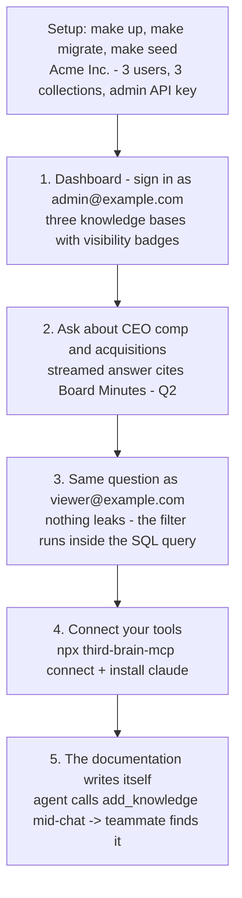

# Third Brain - 3-minute demo

A scripted walkthrough of the core promise: **the documentation writes itself.** Connect your
agents, watch them capture a decision as they work, and see a teammate find it seconds later -
all while permissions hold. It uses the seeded `Acme Inc.` demo data.

Prefer to watch? [`assets/third-brain-demo.mp4`](assets/third-brain-demo.mp4) is 3 minutes,
captioned on screen (no narration audio), and covers this script plus ingestion, the knowledge
graph and the `third-brain-mcp` CLI run.

The whole demo at a glance:



## Setup (once, ~1 min)

```bash
cp .env.example .env         # works with zero API keys (deterministic offline stub model)
make up                      # postgres+pgvector, redis, api, worker, web
make migrate && make seed    # creates Acme Inc. + 3 users + 3 collections
```

`make seed` prints three logins, their shared password (randomly generated per seed) and an admin
API key - **copy the password and the API key**, both are shown once.

> **No well-known credential:** each seed generates a fresh random password unless you pin one via
> `DEMO_PASSWORD` in `.env` (8-128 characters). The login addresses come from `DEMO_ADMIN_EMAIL`,
> `DEMO_ENGINEER_EMAIL` and `DEMO_VIEWER_EMAIL` (defaults on the reserved `example.com` - use your
> own on a real deployment). Set them **before `make up`**: containers capture their environment
> when created, so after editing `.env` run `make up` again before seeding. To rotate an
> already-seeded demo (using the addresses it was seeded with), run
> `DEMO_PASSWORD=... python -m app.scripts.rotate_demo_password`; the old password stops working
> immediately.

> **Zero-key vs. real model:** with no provider key set, the offline stub returns a grounded,
> **cited extract** from the permitted sources - enough to see retrieval and permissions working.
> Add a real key (`OPENAI_API_KEY`, `ANTHROPIC_API_KEY` or `GOOGLE_API_KEY`) to `.env` for fully
> synthesized prose. Either way, the permission filter and citations behave identically.

| User | Role | Can see |
|---|---|---|
| `admin@example.com` | Owner | **Everything** - Handbook, Engineering, Board & Finance |
| `engineer@example.com` | Editor (Engineering team) | Handbook + Engineering - **not** Board & Finance |
| `viewer@example.com` | Viewer | **Only** the org-wide Handbook |

The three collections have contrasting visibility: **Company Handbook** (org-wide), **Engineering**
(team-only), **Board & Finance** (private - board minutes + comp bands).

---

## The script

### 1. The dashboard (~15s)
Open <http://localhost:3000>, sign in as **admin@example.com**. Land on the dashboard: usage stats,
then **Knowledge Bases** → three collections with visibility badges (Organization / Team /
Private). Open **Board & Finance** - the sensitive stuff lives here.

### 2. Ask the brain (~30s)
Go to **Ask**. Ask:

> *"What is the CEO's compensation and are we planning any acquisitions?"*

The answer streams back **grounded in the board minutes**, with **inline citations** to *Board
Minutes - Q2* and *Compensation Bands*. This is retrieval over the company's own knowledge, not the
model guessing.

### 3. Permissions that hold (~30s)
Open an incognito window, sign in as **viewer@example.com**, and ask the **exact same question**.

> The viewer's answer draws **only from the org-wide Handbook** they can see - the compensation and
> acquisition details never appear, and the Board & Finance collection isn't visible to them at
> all. (With a real model configured, it says outright that it doesn't have that information.)

Nothing leaked. The permission filter runs **inside the SQL query** during retrieval, so a chunk
the asker isn't allowed to see can never reach the model, not even indirectly. Sign in as
**engineer@example.com** and try again: they can answer *engineering* questions (runbook, on-call)
but still get nothing on compensation. This is the trust pillar under everything the agents are
about to write.

### 4. Connect your tools (~20s)
Back as **admin@example.com**, wire an agent into the brain - no config files to hand-edit:

```bash
npx third-brain-mcp connect          # prompts for the server URL, then a device-code sign-in:
                                     # it prints a code like KTPB-3947 and opens /activate;
                                     # approve it in the dashboard and a scoped key is saved
npx third-brain-mcp install claude   # writes the Claude Desktop config (also: cursor, claude-code)
```

Your agent now has `search_knowledge`, `get_document`, `list_collections`, `add_knowledge` and
`update_knowledge`, scoped to what the approved key may see and do.

### 5. The documentation writes itself - the wow moment (~45s)
In Claude Desktop (or Claude Code / Cursor), have a normal working conversation and make a
decision. Then, mid-chat, ask the agent to capture it:

> *"We just decided to move on-call to a weekly rotation with a secondary. Write that up into the
> Engineering / Decisions knowledge base."*

The agent calls **`add_knowledge`**. Now switch to a browser signed in as
**engineer@example.com**, open **Ask**, and search:

> *"What's our new on-call rotation?"*

The answer comes back **citing the decision the agent just wrote** - a document nobody sat down to
author. Open **Documents**, switch the author filter from *Everyone* to **Written by agents**, and
the new entry is there with its **Agent-written** badge; the Overview's **Written by agents** card
now lists it too. The knowledge was captured as a byproduct of the work.

And it is still governed: the write landed in Engineering, so the **viewer** (Handbook-only) never
sees it, and had the agent tried to paste a live credential, the secret scanner would have parked
it in quarantine instead of indexing it.

### Also reachable from any LLM client (~20s)
Same brain, same permissions, through interfaces your other tools already speak. Use the admin API
key from `make seed`:

```bash
# OpenAI-compatible endpoint - point any OpenAI SDK at Third Brain:
curl http://localhost:8000/v1/chat/completions \
  -H "Authorization: Bearer tb_your_api_key" \
  -H "Content-Type: application/json" \
  -d '{
    "model": "third-brain",
    "messages": [{"role":"user","content":"Summarize our on-call escalation policy."}]
  }'

# Native REST - search directly:
curl http://localhost:8000/api/v1/search \
  -H "Authorization: Bearer tb_your_api_key" \
  -H "Content-Type: application/json" \
  -d '{"query": "deploy schedule", "top_k": 3}'
```

Both are **grounded in Acme's knowledge and filtered to that key's permissions**.

---

## The one-liner takeaway

> Your team already does the work with LLMs. Third Brain captures it - decisions, answers, docs
> written back by the agents as they go - into one governed brain every client can search, and
> **no one ever retrieves what they're not allowed to see.**

For why this exists, see [`VISION.md`](./VISION.md). For how the permission engine works, see
[`PERMISSIONS.md`](./PERMISSIONS.md).
