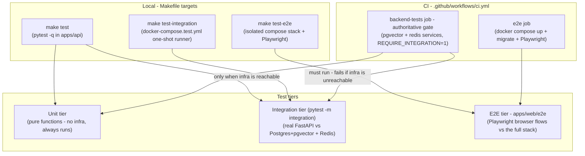
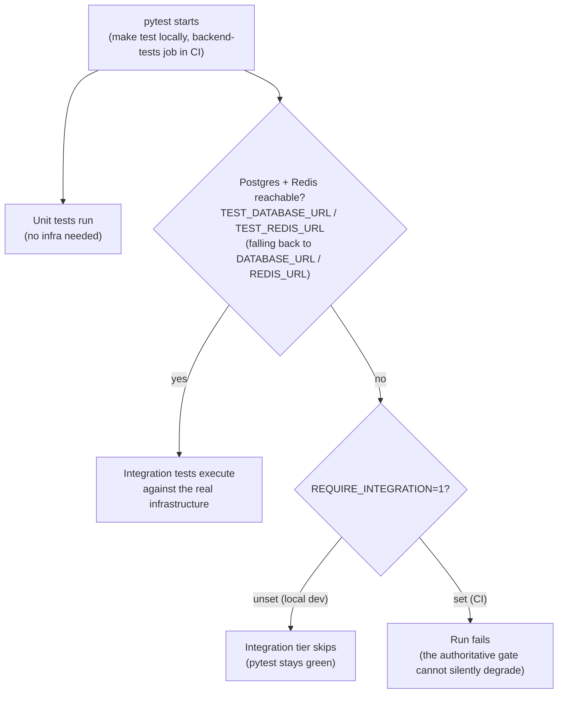

# Development

How to run Third Brain locally. The fastest path is Docker Compose; this guide also
covers running each piece **without Docker** for tight iteration and debugging.

- [Prerequisites](#prerequisites)
- [Option A - Docker Compose (recommended)](#option-a---docker-compose-recommended)
- [Option B - run without Docker](#option-b---run-without-docker)
- [Environment variables](#environment-variables)
- [Common tasks](#common-tasks)
- [Project layout](#project-layout)
- [Troubleshooting](#troubleshooting)

---

## Prerequisites

| Tool | Version | Notes |
|---|---|---|
| Python | 3.11+ | Backend + workers |
| Node.js | 20+ | Frontend |
| PostgreSQL | 16 + [`pgvector`](https://github.com/pgvector/pgvector) | Vector store |
| Redis | 7+ | Cache, rate limiting, task queue |
| Docker + Compose v2 | latest | For Option A |

For real embeddings and answers you need a **provider key** - set `OPENAI_API_KEY`,
`ANTHROPIC_API_KEY` (completions only; Anthropic has no embeddings API), or `GOOGLE_API_KEY`
(Google Gemini), plus `OPENAI_BASE_URL` to point the OpenAI-compatible path at OpenAI, Azure
OpenAI, Ollama, vLLM, or any compatible gateway. Without any key, the app falls back to a
deterministic offline stub so the UI still works, but retrieval quality is meaningless.

---

## Option A - Docker Compose (recommended)

```bash
# 1. Copy the env template. It runs offline as-is; set a key for real answers.
cp .env.example .env
$EDITOR .env            # optional: set OPENAI_API_KEY / ANTHROPIC_API_KEY / GOOGLE_API_KEY (and OPENAI_BASE_URL for Azure/Ollama/vLLM)

# 2. Build and start db (pgvector), redis, api, worker and web.
make up                 # == docker compose up --build

# 3. In another shell, run migrations and seed a demo org.
make migrate            # alembic upgrade head
make seed               # creates a demo org, three users and three knowledge bases
```

Services:

| URL | Service |
|---|---|
| http://localhost:8000 | API (interactive docs at `/docs`) |
| http://localhost:8000/api/v1/health | Liveness/readiness probe |
| http://localhost:3000 | Web dashboard |
| localhost:5432 | Postgres |
| localhost:6379 | Redis |

The demo seed prints three logins that share one randomly generated password -
`admin@example.com` (owner), `engineer@example.com` (editor) and `viewer@example.com`
(viewer) - plus a one-time admin API key. Copy the password and the key; they are shown
only once. Asking the same question as each user shows permission-aware retrieval.

Handy Make targets: `make logs`, `make down`, `make shell` (api container), `make test`,
`make lint`, `make fmt`. Run `make` with no arguments for the full list.

---

## Option B - run without Docker

Useful when you want a debugger attached or fast reloads without container overhead. You
still need Postgres and Redis running somewhere; the simplest is to run just those two in
Docker and everything else on the host:

```bash
docker compose up -d db redis
```

Or install them natively (macOS: `brew install postgresql@16 redis`, then add the
`pgvector` extension). Whichever you choose, point the app at them via `.env` - the
defaults assume the Docker hostnames `db`/`redis`, so override the host:

```dotenv
# .env  (host-run overrides)
POSTGRES_HOST=localhost
POSTGRES_PORT=5432
REDIS_URL=redis://localhost:6379/0
OPENAI_API_KEY=sk-...
# The default STORAGE_LOCAL_PATH=/data/uploads is a Docker VOLUME path. Running the API
# OUTSIDE Docker, point it at a writable host directory or file ingestion will fail:
STORAGE_LOCAL_PATH=./var/uploads
```

> [!IMPORTANT]
> When running the API without Docker, `STORAGE_LOCAL_PATH` must be a directory you can
> write to. The packaged default (`/data/uploads`) only exists as a mounted Compose
> volume; on the host it is typically not writable, so uploads would fail to persist.

### Backend API

```bash
cd apps/api

# Create a virtualenv and install the package with dev extras.
python3.11 -m venv .venv
source .venv/bin/activate
pip install -e ".[dev]"

# Apply migrations (uses the sync psycopg URL derived from your .env).
alembic upgrade head

# (optional) seed demo data
python -m app.scripts.seed

# Run the API with autoreload.
uvicorn app.main:app --reload --port 8000
```

The API loads configuration from the repo-root `.env` (see
[`app/core/config.py`](../apps/api/app/core/config.py)). Environment variables always win
over the `.env` file.

### Background worker

Ingestion (extract → scan (secrets, DLP) → chunk → embed → index → enrich) runs in an
[`arq`](https://arq-docs.helpmanual.io/) worker so uploads return immediately. Run it in a
second terminal (same virtualenv/env):

```bash
cd apps/api
source .venv/bin/activate
arq app.workers.settings.WorkerSettings
```

Without a running worker, documents stay in `status="pending"` and never index.

### Frontend

```bash
cd apps/web
npm install
# Point the browser client at your local API:
echo 'NEXT_PUBLIC_API_URL=http://localhost:8000' > .env.local
npm run dev            # http://localhost:3000
```

---

## Environment variables

Everything is configured through the root `.env` (template:
[`.env.example`](../.env.example)). The most important keys:

| Variable | Default | Purpose |
|---|---|---|
| `ENVIRONMENT` | `development` | `development` \| `staging` \| `production` |
| `SECRET_KEY` | `change-me` | Signs JWTs **and** derives the Fernet key that encrypts connector secrets. Set a long random value. |
| `POSTGRES_HOST` / `POSTGRES_PORT` / `POSTGRES_USER` / `POSTGRES_PASSWORD` / `POSTGRES_DB` | `db` / `5432` / `thirdbrain` × 3 | Assembled into the async DB URL. |
| `DATABASE_URL` | _(unset)_ | Explicit override; wins over the parts above. Use the `postgresql+asyncpg://` scheme. |
| `REDIS_URL` | `redis://redis:6379/0` | Cache / rate-limit / queue. |
| `EMBEDDING_MODEL` / `EMBEDDING_DIM` | `text-embedding-3-small` / `1536` | Must match - changing the dimension requires a re-index. |
| `DEFAULT_COMPLETION_MODEL` | `gpt-4o-mini` | Default chat model. |
| `CHUNK_TARGET_TOKENS` / `CHUNK_SIZE_TOKENS` / `CHUNK_OVERLAP_TOKENS` | `768` / `1024` / `64` | Boundary-aware chunking: TARGET is the preferred size (a chunk closes at the next heading/paragraph/sentence boundary past it), SIZE is the hard ceiling, OVERLAP applies only to the forced split of a single oversized sentence. |
| `RETRIEVAL_TOP_K` | `8` | Default number of hits. |
| `OPENAI_API_KEY` / `OPENAI_BASE_URL` | _(blank)_ / `https://api.openai.com/v1` | OpenAI-compatible endpoint (OpenAI, Azure, Ollama, vLLM, …). Per-org overrides live in **Connectors**. |
| `ANTHROPIC_API_KEY` / `GOOGLE_API_KEY` | _(blank)_ | Native Anthropic (completions only) and Google Gemini providers. All provider keys blank = offline stub. |
| `STORAGE_BACKEND` | `local` | `local` \| `s3` for uploaded files. |
| `NEXT_PUBLIC_API_URL` | `http://localhost:8000` | Where the browser reaches the API. |

`.env` is git-ignored. Never commit real secrets.

---

## Common tasks

```bash
# Create a new migration after changing models
cd apps/api && alembic revision --autogenerate -m "add widget table"
alembic upgrade head

# Backend tests / lint / format
pytest -q
ruff check app
ruff format app

# Frontend lint / build
cd apps/web && npm run lint && npm run build
```

How the three test tiers map onto local Make targets and CI jobs:



At runtime, pytest probes the infrastructure to decide whether the integration tier
executes, skips, or fails:



---

## Project layout

```
third-brain/
├── apps/
│   ├── api/          # FastAPI backend (REST + OpenAI-compat + MCP) + arq workers
│   └── web/          # Next.js 15 dashboard
├── docs/             # this directory
├── .github/workflows # CI
└── docker-compose.yml
```

See [`ARCHITECTURE.md`](./ARCHITECTURE.md) for the system design, [`API.md`](./API.md) for
the HTTP surface, and [`PERMISSIONS.md`](./PERMISSIONS.md) for the access model.

---

## Troubleshooting

- **`/api/v1/health` reports `"status": "degraded"`** - one of the `database`/`redis` checks
  failed. Confirm both are reachable and your `POSTGRES_HOST` / `REDIS_URL` are correct
  for where you're running the API.
- **`type "vector" does not exist`** - your Postgres image lacks `pgvector`. Use the
  `pgvector/pgvector:pg16` image (Compose does this) or `CREATE EXTENSION vector;`.
- **Documents stuck in `pending`** - the `arq` worker isn't running. Start it (Option B)
  or check the `worker` container's logs (`make logs`).
- **Alembic can't connect** - migrations use the **sync** psycopg URL derived from your
  env. Ensure `psycopg[binary]` is installed (it is a required runtime dependency, pulled
  in by `pip install -e .`) and the DB host is right.
- **`Can't locate revision identified by '0002_waitlist'`** - the pre-1.0 migrations were
  squashed into the single `0001_initial` baseline while the product was unreleased. Reset
  the dev DB (`docker compose down -v && make up-d && make migrate && make seed`) or keep
  your data with
  `docker compose exec db psql -U thirdbrain -c "UPDATE alembic_version SET version_num = '0001_initial'"`.
- **401 from the API** - your access token expired (30 min by default). The dashboard
  refreshes automatically; `curl`/API callers should re-login or use an API key.
