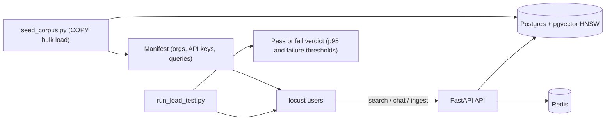

# Third Brain - Load Testing

How to prove the claims in [`docs/SCALING.md`](SCALING.md) on your own hardware: seed
`document_chunks` to millions of embedded rows, drive realistic permission-scoped
search/chat/ingestion traffic against the real stack, and get a pass/fail verdict against
latency and error thresholds.

## 1. Why this exists

Everything interesting about Third Brain's performance happens in one place: an ANN scan
over the `document_chunks` HNSW index **with the `RetrievalScope` ACL predicate pushed into
the SQL `WHERE` clause**. At a few thousand chunks any index looks fast. The honest
question is what happens at millions of chunks, when the iterative post-filter has to walk
past other tenants' candidates to fill a single org's result set, and dozens of concurrent
users are doing it at once while ingestion writes race the same table.

Microbenchmarks do not answer that. This harness does: it builds a corpus big enough for
the index to matter, with the same mixed-visibility permission graph real tenants have,
then measures the endpoints users actually hit.

## 2. What the harness does

The harness lives in `apps/api/loadtests/` and has three parts:



**The seeder (`seed_corpus.py`)** builds a synthetic but structurally honest corpus:

- **A real entity graph, not just rows.** Orgs, users, teams, collections, documents and
  chunks with **mixed visibility** (org-wide, team-restricted, private), plus **non-admin
  API keys** per org, so every load-test query exercises the same permission math as
  production traffic. An admin key per org is included for write tasks.
- **COPY bulk load.** Chunks stream into Postgres via `COPY`, not the ORM, so a
  million-chunk corpus loads in minutes instead of days.
- **Offline-stub-identical embeddings.** Vectors are computed exactly like the
  deterministic offline stub provider, so query-time embeddings (produced by the same
  stub) land in the right neighborhoods and searches return real matches.
- **HNSW drop/rebuild.** The HNSW index is dropped before the bulk load and rebuilt once
  after (one build beats millions of incremental inserts); pass `--keep-index` to skip
  that. The rebuild runs under `--maintenance-mem` (default `2GB`) and
  `--index-parallel-workers` (default `4`). Size `--maintenance-mem` to hold the whole
  graph - roughly `chunks * EMBEDDING_DIM * 4` bytes. If the graph does not fit in
  `maintenance_work_mem`, pgvector spills the build to disk and it slows by an order of
  magnitude; this is the single-node build-memory boundary described in
  [`docs/SCALING.md`](SCALING.md).

Run it from `apps/api` (or via `make load-seed`):

```bash
python -m loadtests.seed_corpus --chunks 1000000 \
    --orgs 20 --collections-per-org 5 --chunks-per-doc 8 \
    --manifest loadtests/.manifest.json
```

It reads the database URL from the same settings as the app (`app.core.config` /
`DATABASE_URL`), and writes a **manifest** (`loadtests/.manifest.json` by default)
recording the chunk count, embedding dimension, every seeded org with its `org_id`, member
and admin API keys and collection ids, and about 200 short synthetic queries that match the
seeded content.

**The locust file (`locustfile.py`)** reads that manifest. Each simulated user picks a
seeded org, authenticates with its **member (non-admin) API key**, and runs a weighted task
mix modeled on real usage: mostly permission-scoped search (`POST /api/v1/search`, hybrid and
vector-only), regularly RAG chat (`POST /api/v1/search/chat`, JSON and streamed SSE), plus
occasional document-ingestion writes (`POST /api/v1/documents/text`, using the org's admin
key) and calls to the OpenAI-compatible embeddings surface (`POST /v1/embeddings`).
Configuration is two env vars: `MANIFEST` (default `loadtests/.manifest.json`) and `API_BASE`
(default `http://localhost:8000`).

**The threshold runner (`run_load_test.py`)** wraps locust headless, writes stats CSVs,
prints a per-endpoint results table, and exits nonzero when thresholds are breached, so a
run is a verdict rather than a wall of numbers.

| Variable | Default | Meaning |
|---|---|---|
| `LOAD_USERS` | `50` | Concurrent simulated users |
| `LOAD_SPAWN_RATE` | `10` | Users spawned per second at ramp-up |
| `LOAD_DURATION` | `3m` | Steady-state run length |
| `LOAD_MAX_FAIL_PCT` | `1.0` | Max allowed request failure percentage |
| `LOAD_P95_SEARCH_MS` | `750` | p95 latency budget for search requests |
| `LOAD_P95_CHAT_MS` | `1500` | p95 latency budget for chat requests |
| `LOAD_CSV_DIR` | `/tmp/tb_load` | Where locust stats CSVs are written |

## 3. Quickstart

```bash
# 1. Install the API package with the load extra (locust is not a runtime dependency)
cd apps/api && pip install -e ".[dev,load]"

# 2. Start Postgres(+pgvector), Redis, API and worker: `make up`, or run the pieces
#    directly per docs/DEVELOPMENT.md. Zero keys needed; the offline stub provider
#    embeds and answers deterministically. Apply migrations once the stack is up:
#    `make migrate` (the seeder writes into the real schema and needs the tables).

# 3. Seed the corpus (from the repo root; SCALE defaults to 1000000)
make load-seed SCALE=1000000

# 4. Drive load and get a verdict
make load-test LOAD_USERS=50 LOAD_DURATION=3m
```

Both targets accept the env vars above on the `make` command line (for example
`make load-test LOAD_USERS=200 LOAD_P95_SEARCH_MS=500 API_BASE=http://localhost:8000`).
Seeding a million chunks takes minutes and is dominated by the HNSW rebuild; re-running the
seeder replaces the previous synthetic corpus and rewrites the manifest.

## 4. Reading the results

The runner prints one row per endpoint: request count, failure percentage, median and p95
latency, then the verdict line comparing each measured value to its budget. The stats CSVs
in `LOAD_CSV_DIR` hold the full distribution if you want more than the table.

What p95 means here: with the offline stub in place there is **no provider latency in the
numbers** (see caveats), so search p95 is almost purely the platform: the ACL-filtered ANN
scan over the HNSW index, permission-scope resolution, Redis, and serialization. That makes
it the single most honest number for "does permission-scoped retrieval hold up at this
scale". If search p95 climbs as `SCALE` grows, you are watching the filtered-HNSW cost
described in [`docs/SCALING.md`](SCALING.md); reach for the levers there (smaller
embedding dimensions, `hnsw.ef_search`, partitioning by `org_id`).

To explain an individual slow or failed request, use the correlation chain from
[`docs/OBSERVABILITY.md`](OBSERVABILITY.md): every response carries `X-Request-ID`, so grep
the API logs for that `request_id`, and if tracing is on (`make up-obs`), follow the
`trace_id` on those lines into the trace waterfall to see whether the time went to SQL,
Redis, or the pipeline stages.

### Reference run

A concrete run to set expectations (single developer laptop, 16 GB RAM, one uvicorn
process, `EMBEDDING_DIM=1536`, offline stub). Numbers are illustrative, not guarantees;
real hardware, replica count and embedding dimension move them.

- **Seed, 1,000,000 chunks / 10 orgs:** `COPY` loaded the chunks in ~245s (~4,100 rows/s);
  the HNSW rebuild took ~54 min with `--maintenance-mem 6GB` (the ~6.1 GB of vectors just
  fits in 6 GB, so the build stays mostly in memory). At the default `2GB` the same build
  spilled to disk and ran far longer - the build-memory boundary is real, and the reason
  the seeder warns when the graph will not fit.
- **50 users, 2 min:** 0 failures; ACL-filtered hybrid search **p95 630 ms / p99 730 ms**
  at ~31 req/s, vector-only search p95 520 ms, chat (JSON and streamed) p95 630 ms,
  embeddings p95 270 ms; ~70 req/s aggregate. All thresholds pass.
- **150 users:** throughput plateaus near ~74 req/s (a single API process is CPU-bound),
  latency climbs (p95 ~3 s) but **still 0 failures** - it degrades by queuing, not by
  erroring or tipping over. The lever is horizontal API replicas (see
  [`docs/SCALING.md`](SCALING.md)), not a code change.

## 5. Caveats

- **The offline stub means zero real LLM latency.** Chat p95 here measures retrieval,
  permission filtering, prompt assembly and streaming plumbing, not a provider round-trip.
  That is the point: this harness qualifies *the platform*. Add a real provider key only
  if you deliberately want provider latency mixed in.
- **The seeder bypasses the API on purpose.** Ingesting millions of chunks through the
  upload endpoint and arq workers would take days; `COPY` builds the corpus in minutes.
  The ingestion path itself is still exercised, at realistic per-request volume, by the
  locust write tasks.
- **Never run against production.** The seeder writes synthetic orgs, users and API keys
  directly into the target database and drops/rebuilds the HNSW index. Point
  `DATABASE_URL` at a dev or staging stack only. As a guard it refuses to run when
  `ENVIRONMENT=production` unless you pass `--force-production`.
- **Not part of CI.** Seeding and driving a multi-minute load run is an on-demand,
  human-triggered activity; CI stays fast and deterministic (see the testing tiers in
  [`CONTRIBUTING.md`](../CONTRIBUTING.md#tests)).
