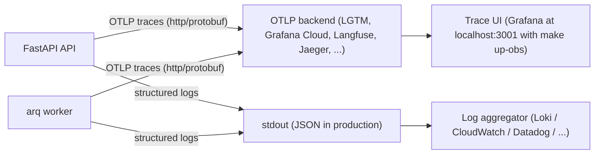

# Third Brain - Observability

How to see what the system is doing: structured logs, distributed traces, and the
correlation ids that tie a browser request, its API call, its LLM calls and its background
ingestion job into one story.

## 1. Philosophy

- **Structured logs are always on.** Every process (API, worker, migrations) emits one
  structured line per event through the same pipeline; nothing to configure.
- **Tracing is opt-in with one env var.** Set `OTEL_EXPORTER_OTLP_ENDPOINT` and full
  distributed tracing turns on. Leave it blank and every span call is a non-recording
  no-op with near-zero cost - dev, CI and tests run clean with zero configuration.
- **Vendor-neutral.** Traces leave the process as standard OTLP (http/protobuf), so the
  same build ships to a local Grafana stack, Grafana Cloud, Langfuse, Jaeger or Tempo by
  changing an endpoint, not code.
- **No content is ever collected.** Prompts, chat messages, document text, query text and
  credentials never appear in logs or span attributes. Telemetry carries metadata only:
  counts, token usage, models, ids, durations.



## 2. The log pipeline

Logging lives in `app/core/logging.py` and is built on **structlog**. One stdout handler
runs a single processor chain for everything - structlog call sites and third-party
stdlib loggers (uvicorn, arq, sqlalchemy, alembic) alike - so every line renders
uniformly.

- **Format** - `LOG_FORMAT=auto` (default) renders pretty console output in development
  and JSON everywhere else; force one with `console` or `json`. JSON lines are ready for
  Loki, CloudWatch, Datadog or any aggregator without a parsing config.
- **Call style** - `get_logger(__name__)` returns a stdlib-compatible logger; new code
  logs events with key=value fields (`logger.info("document_ingested", document_id=...,
  chunks=n)`), and classic `%s` formatting keeps working.
- **Bound context** - `structlog.contextvars` carries request- and job-scoped fields, so
  every line emitted while handling a request or job automatically includes them:
  `request_id`, `org_id`, `user_id`, `job_id`, `document_id`. When a trace is being
  recorded, `trace_id` and `span_id` are stamped on the line too.
- **Secret redaction** - a processor replaces the value of any top-level key that looks
  like a credential (`password`, `secret`, `token`, `api_key`, `authorization`, `cookie`,
  `credential`) with `[REDACTED]`; keys ending in `_id` (e.g. `api_key_id`) are
  identifiers and pass through. This is a backstop, not a license: never log content or
  secrets in the first place.

## 3. Tracing

Tracing lives in `app/core/telemetry.py`. The API calls `setup_telemetry()` at startup
and `shutdown_telemetry()` (flush) on exit; the worker does the same. Everything else
just asks for `get_tracer(__name__)`, which is always safe to call.

What gets traced when the endpoint is set:

- **Auto-instrumentation** - FastAPI server spans (health checks and docs excluded),
  SQLAlchemy queries, outbound `httpx` calls and Redis commands, so a slow request
  decomposes into its SQL, cache and provider time with no manual work.
- **LLM spans at the narrow waist** - `app/services/llm/client.py` is the only place that
  talks to providers, so it is the only place LLM spans are made. Spans follow the
  OpenTelemetry `gen_ai` conventions: `gen_ai.operation.name` (`embeddings` / `chat`),
  `gen_ai.request.model`, `gen_ai.system`, `gen_ai.usage.input_tokens` /
  `gen_ai.usage.output_tokens`, `gen_ai.response.finish_reasons` and `server.address`.
  Token usage and latency ride on the span; prompt and completion text never do.
- **Pipeline stage spans** - retrieval (scope resolution, embed, vector search, keyword
  search) and ingestion (extract, chunk, embed, index) are wrapped in named spans
  (`retrieval.*`, `ingest.*`), so "where did the time go" is answered by the trace
  waterfall.
- **Sampling** - `OTEL_TRACES_SAMPLE_RATIO` (default `1.0`) ratio-samples new traces with
  a parent-based sampler, so a sampled inbound trace is always continued. Lower it in
  high-traffic production; keep `1.0` locally.

## 4. Cross-process correlation

One id chain links every layer:

- **`X-Request-ID` header <-> `request_id` log field.** The API accepts an inbound
  `X-Request-ID` (or mints one), binds it to the logging context, echoes it on the
  response, and includes it in every error envelope. Clients that log the header can be
  matched to server logs directly.
- **`request_id` <-> `trace_id`.** Log lines emitted inside a recorded trace carry both,
  so you can jump from a grep to the trace UI and back.
- **arq `traceparent` propagation.** When an upload enqueues an ingestion job, the W3C
  `traceparent` is carried through the arq job payload and restored in the worker, so the
  HTTP request and its background job appear as **one trace**. The worker also binds
  `job_id` and `document_id` to its log context for the duration of the job.
- **Usage metering.** `UsageRecord.latency_ms` is populated from the wall time of the
  provider call, so per-org latency analytics come from the same measurement the spans
  show. For a streamed completion the time to first token rides on the span
  (`app.ttft_ms`) and the `llm_call` log line as `ttft_ms`.

**Rolling deploys.** Roll out the arq worker before or together with the API. The API now
enqueues correlation kwargs (`request_id`, `traceparent`, `tracestate`) with each ingestion
job; an older worker whose `ingest_document_task` signature predates those parameters would
reject the job.

## 5. Running locally

```bash
make up-obs        # the normal stack + grafana/otel-lgtm (Grafana, Tempo, Loki, Prometheus)
```

Then set in `.env` (and restart api/worker if already running):

```bash
OTEL_EXPORTER_OTLP_ENDPOINT=http://lgtm:4318      # API inside docker-compose
# OTEL_EXPORTER_OTLP_ENDPOINT=http://localhost:4318   # API running on the host
```

- **Grafana** is at `http://localhost:3001` (port 3000 is taken by the web app). The
  otel-lgtm image logs in anonymously as admin by default.
- **Traces** land in Tempo: Explore -> Tempo data source, query by trace id or search by
  service (`third-brain-api`, `third-brain-worker`).
- **Logs** stay on container stdout (`make logs` / `docker compose logs api worker`); the
  compose stack deliberately ships no log forwarder. In production point your platform's
  log driver or agent (promtail, CloudWatch agent, Datadog agent) at container stdout -
  the JSON lines need no parsing rules.

The LGTM container stores its data in the `lgtm_data` volume, so traces survive restarts.

## 6. Pointing at other backends

Any OTLP (http/protobuf) backend works. The exporter appends `/v1/traces` to the endpoint
automatically (a full `.../v1/traces` URL is also accepted).

**Grafana Cloud**

```bash
OTEL_EXPORTER_OTLP_ENDPOINT=https://otlp-gateway-<region>.grafana.net/otlp
OTEL_EXPORTER_OTLP_HEADERS=Authorization=Basic <base64 of instanceID:token>
```

**Langfuse** (LLM-focused tracing; understands the `gen_ai` attributes natively)

```bash
OTEL_EXPORTER_OTLP_ENDPOINT=https://cloud.langfuse.com/api/public/otel
OTEL_EXPORTER_OTLP_HEADERS=Authorization=Basic <base64 of public_key:secret_key>
```

**Jaeger** (all-in-one, OTLP enabled by default)

```bash
OTEL_EXPORTER_OTLP_ENDPOINT=http://jaeger:4318
```

**Self-hosted Tempo**

```bash
OTEL_EXPORTER_OTLP_ENDPOINT=http://tempo:4318
```

## 7. Environment variable reference

| Variable | Default | Meaning |
|---|---|---|
| `LOG_LEVEL` | `INFO` | Root log level for all loggers |
| `LOG_FORMAT` | `auto` | `auto` (console in development, JSON otherwise), `console`, or `json` |
| `OTEL_EXPORTER_OTLP_ENDPOINT` | blank | OTLP http/protobuf endpoint; blank disables tracing entirely |
| `OTEL_EXPORTER_OTLP_HEADERS` | blank | Comma-separated `key=value` pairs sent with every export (auth) |
| `OTEL_SERVICE_NAME` | blank | Overrides `service.name` (defaults: `third-brain-api`, `third-brain-worker`) |
| `OTEL_TRACES_SAMPLE_RATIO` | `1.0` | Fraction of new traces sampled (parent-based, so sampled callers are honored) |

## 8. Debugging recipes

**A request failed.** Every error envelope includes `request_id`. Filter the logs for it,
then follow the `trace_id` on those lines into the trace UI:

```bash
docker compose logs api | grep 9f2c1a...        # request_id from the error response
# JSON logs: jq 'select(.request_id == "9f2c1a...")'
```

The matching lines show the failing event with its context (`org_id`, `user_id`, status,
`duration_ms`); the trace shows which span - SQL, Redis, provider call - failed or
stalled.

**Ingestion is stuck.** Documents transition `pending -> processing -> indexed | failed`.
Filter both api and worker logs by the document:

```bash
docker compose logs api worker | grep <document_id>
```

The matching lines are coarse transitions, not per-stage detail: `ingestion_status`
(`status=processing|indexed|failed`) plus the worker's `worker_ingest_started` /
`worker_ingest_finished` bracketing the job, each carrying `job_id` and `document_id`. The
per-stage breakdown (`ingest.load_extract`, `ingest.chunk`, `ingest.embed`, `ingest.index`)
lives in the trace, not the logs. Because the `traceparent` is propagated through arq, the
upload request's trace continues into the job - open it to see which stage is slow,
including per-batch embedding calls with token counts.

**An LLM call is slow or expensive.** Search traces for `gen_ai.request.model` spans; the
span shows the provider (`server.address`), token usage and duration, and
`usage_records.latency_ms` gives the same number per org over time.
