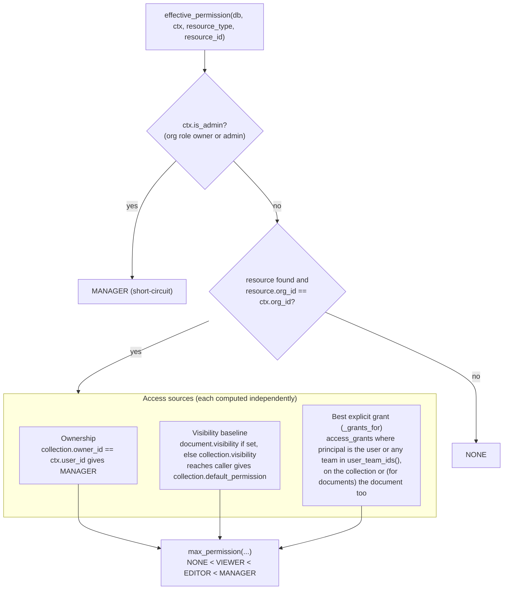
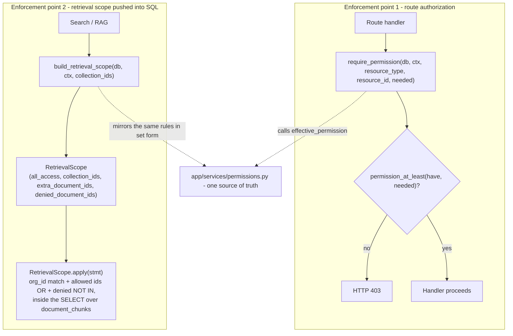

# Permissions

The permission engine is the heart of Third Brain. It answers one question - *"can this
principal do this to this resource?"* - and it answers it **the same way in two places**
that must never disagree:

1. **Route authorization** - can the caller read/edit/manage this collection or document?
2. **Retrieval filtering** - which chunks may this caller's search even see?

Both are implemented in
[`app/services/permissions.py`](../apps/api/app/services/permissions.py). This document
explains that model.

- [Principals, resources, levels](#principals-resources-and-levels)
- [The core rule: maximum of all sources](#the-core-rule-maximum-of-all-sources)
- [Access sources in detail](#access-sources-in-detail)
- [Documents inherit from collections](#documents-inherit-from-collections)
- [Two enforcement points](#two-enforcement-points)
- [Retrieval scope](#retrieval-scope)
- [API keys as principals](#api-keys-as-principals)
- [Worked examples](#worked-examples)
- [Public API](#public-api)
- [Invariants](#invariants)

---

## Principals, resources, and levels

**Principals** (who is asking):

- a **user** (via a JWT dashboard session, or an API key bound to a user through
  `acts_as_user_id`), and/or
- the **teams** that user belongs to (`team_members`), **plus every ancestor of those teams**
  (nested-team reach flows downward - see [Nested teams](#nested-teams)).

**Resources** (what is being accessed): a **collection** (knowledge base) or a **document**.

**Permission levels** are totally ordered (`app/models/enums.py`):

| Level | Rank | Grants |
|---|---|---|
| `none` | 0 | nothing |
| `viewer` | 1 | read + search |
| `editor` | 2 | viewer + add/update content |
| `manager` | 3 | editor + manage grants + delete |

Helpers: `permission_at_least(have, need)` and `max_permission(*levels)`. The **org role**
(`owner` / `admin` / `editor` / `viewer`) is a separate, org-wide axis; owners and admins
are effectively `manager` on everything in their org.

---

## The core rule: maximum of all sources

> A principal's **effective permission** on a resource is the **maximum** permission
> reachable through *any* access source.

Access is additive and never subtractive: no source can *reduce* a permission another
source grants. Concretely, `effective_permission` takes the max over:

```
effective_permission(user, resource) = max(
    org_role_baseline,          # org owner/admin  => MANAGER everywhere
    ownership,                  # collection owner => MANAGER
    visibility_baseline,        # if visibility "reaches" the caller => collection.default_permission
    direct_user_grant,          # access_grants where principal = this user
    best_team_grant,            # access_grants where principal ∈ user's teams
    inherited_from_collection,  # documents only: grants/visibility on the parent collection
)
```

How `effective_permission` walks these sources in `app/services/permissions.py`:



A document's own `visibility` **overrides** its collection's for the visibility baseline, and
that override applies at **both** enforcement points: `effective_permission` computes the
baseline from `document.visibility or collection.visibility` (so a `private` document inside
an `org`/`viewer` collection resolves to `none`, and 403s, for a member with no other source),
and retrieval mirrors it as its one subtractive step, `denied_document_ids` (see
[Retrieval scope](#retrieval-scope)). Ownership, explicit grants on the document or its
collection, and the org-admin baseline still apply on top.

---

## Access sources in detail

### 1. Org role baseline

Org **owners** and **admins** (`AuthContext.is_admin`) short-circuit to `manager` on every
resource in their org. Regular members (`editor`/`viewer` org roles) get nothing from the
role baseline alone - they must reach the resource through visibility or a grant.

### 2. Ownership

The user who owns a collection (`collection.owner_id`) is always `manager` on it (and, by
inheritance, on its documents).

### 3. Visibility baseline

A collection's (or document's) **visibility** decides who is "reached" *before* explicit
grants. If the caller is reached, they receive the collection's **`default_permission`**
(commonly `viewer`):

| Visibility | Who it reaches |
|---|---|
| `private` | no one via visibility (only owner, explicit grants, org admins) |
| `team` | members of the collection's owning team (`owner_team_id`) **and its sub-teams** |
| `org` | everyone in the organization |
| `public` | everyone in the organization |

So a `visibility = org`, `default_permission = viewer` collection is readable by every
member; setting `default_permission = editor` would let every member add content.

> **`org` vs `public` today:** the permission engine treats these identically - both reach
> every member of the organization (including a bare org API key). `public` is reserved for a
> future unauthenticated/link-shared read mode and grants no anonymous access today.

### Nested teams

Team reach flows **downward**. `user_team_ids(ctx)` expands to the caller's direct teams
**plus every ancestor team**, so a member of sub-team `B` (child of `A`) is reached by any
`team`-visibility collection owned by `A` and by any grant whose principal is team `A`. A
parent never inherits a child-only grant. Practically: granting a parent team access shares
it down to every descendant team; granting a child team does not leak up to the parent.

### 4. Explicit grants (users and teams)

`access_grants` rows are ACL entries: `(resource_type, resource_id, principal_type,
principal_id, permission)`. The engine considers grants whose principal is the calling
**user** or any of the user's **teams**, and takes the best one. Grants can raise
permission above the visibility baseline (e.g. give one team `manager` on an otherwise
`org`/`viewer` collection).

---

## Documents inherit from collections

A document's effective permission is the **max** of everything that applies to the document
*and* everything inherited from its parent collection:

- collection ownership and admin still apply,
- explicit grants on **either** the collection **or** the document count,
- the **visibility baseline** uses the document's own `visibility` when set, otherwise the
  collection's; reaching it grants the collection's `default_permission`.

This means a document can be made *more* visible than its collection (its own `visibility`),
or singled out for a specific principal via a document-level grant - but it always inherits
the collection's ownership and explicit grants; only the visibility baseline is replaced when
the document sets its own, including when that override is *stricter* (see
[Retrieval scope](#retrieval-scope)).

---

## Two enforcement points



Route handlers call `require_permission(db, ctx, rtype, rid, needed)` (raises `403` if the
caller's effective permission is below `needed`). Search builds a `RetrievalScope` and
`.apply()`s it to the `SELECT` over `DocumentChunk`. Because both derive from the same
rules, **a chunk you cannot view cannot be retrieved, cited, or fed to an LLM.**

---

## Retrieval scope

`build_retrieval_scope(db, ctx, collection_ids=None)` resolves, in one pass, the universe of
chunks the caller may retrieve, as a SQL predicate rather than a post-filter:

1. **Admins** get `all_access=True` (every chunk in the org), optionally narrowed to the
   `collection_ids` the search requested.
2. For everyone else it collects:
   - **visible collections** - those the caller owns or whose visibility reaches them;
   - **granted collections/documents** - anything reached via a user/team `access_grant`
     with permission `>= viewer` (collection grants widen the collection set; document
     grants add specific `extra_document_ids`);
   - **denied documents** - a document inside an otherwise-visible collection whose *own*
     `visibility` does not reach the caller (`private`, or `team` when the caller is not in
     the owning team) is **excluded**, *unless* the caller reaches the whole collection
     strongly - as its owner or through a collection-level grant - or holds a direct grant
     on that document (this is the one place access is subtractive);
   - **upward overrides** - conversely, a document whose own `visibility` reaches the caller
     while its collection's does not (e.g. an `org` document inside a `private` collection)
     is added to `extra_document_ids`.
3. If the search specified `collection_ids`, the visible set is intersected with it.

`RetrievalScope.apply(stmt)` then adds: `org_id` match, an `OR` over allowed collection/
document ids (or an impossible predicate if the caller can see nothing), and a `NOT IN` for
denied documents. `all_access` short-circuits to just the `org_id` filter (minus denials).

---

## API keys as principals

An API key belongs to a fixed org and carries scopes. Its effective **org role** is:

- the role of the user it impersonates (`acts_as_user_id`), if set; otherwise
- derived from scopes: `manage`/`*` → admin, `write`/`ingest` → editor, else viewer.

When a key impersonates a user, ACL resolution uses that user's identity and teams - so the
key sees exactly what that user would, no more. A bare key (no `acts_as_user_id`) has no
user/team identity, so it reaches resources only through org-role baseline and collection
visibility, not through user/team grants. This is why binding keys to a service user is the
recommended way to give them precise, grant-based access.

---

## Worked examples

**Org-wide handbook.** Collection `visibility = org`, `default_permission = viewer`. Every
member gets `viewer` from the visibility baseline → can search it. Admins get `manager`.

**Team runbooks.** Collection `visibility = team`, owned by team *SRE*. Only *SRE* members
are reached by visibility (→ `viewer`/whatever `default_permission` is). A grant giving
*SRE* `editor` lets them add runbooks; other members see nothing unless separately granted.

**Private collection, one shared doc.** Collection `visibility = private` (no baseline
reach). Owner is `manager`. Grant user *Dana* `viewer` on a single document → Dana can
retrieve only that document's chunks (via `extra_document_ids`), nothing else in the
collection.

**Private document inside an org collection.** Collection `visibility = org` (everyone
`viewer`), but one document is `visibility = private`. That document's chunks land in
`denied_document_ids` for members who reach the collection only through its visibility - so
it disappears from their search results even though the collection is org-visible, and
`GET /api/v1/documents/{id}` 403s for them too. It stays visible to org admins, the
collection owner, holders of a collection-level grant, and anyone with a direct grant on
that document.

---

## Public API

From `app/services/permissions.py`:

| Function | Purpose |
|---|---|
| `effective_permission(db, ctx, resource_type, resource_id) -> PermissionLevel` | The caller's computed level on a resource. |
| `require_permission(db, ctx, rtype, rid, needed)` | Assert `>= needed`, else raise `403`. |
| `build_retrieval_scope(db, ctx, collection_ids=None) -> RetrievalScope` | Resolve the caller's visible chunk universe. |
| `RetrievalScope.apply(select_over_DocumentChunk) -> Select` | Push the visibility predicate into a query. |
| `user_team_ids(db, ctx) -> set[UUID]` | The caller's team ids, expanded to include every ancestor team. |

The HTTP surface exposes it via
`GET /api/v1/permissions/effective?resource_type=&resource_id=` (returns `{permission}`) and
the CRUD endpoints under `/api/v1/permissions` for managing `access_grants`.

---

## Invariants

- **Additive by default**: no source lowers another source's grant. The single subtractive
  step is retrieval's `denied_document_ids`, which enforces a document's own stricter
  `visibility` - the same override `effective_permission` already applies.
- **Org-scoped always**: resources in another org resolve to `none`/`404`.
- **One source of truth**: routes and retrieval both call this module - they can never drift
  apart.
- **Deny by default**: absent any reaching source, effective permission is `none` and the
  retrieval scope is empty (an impossible SQL predicate), not "everything".
