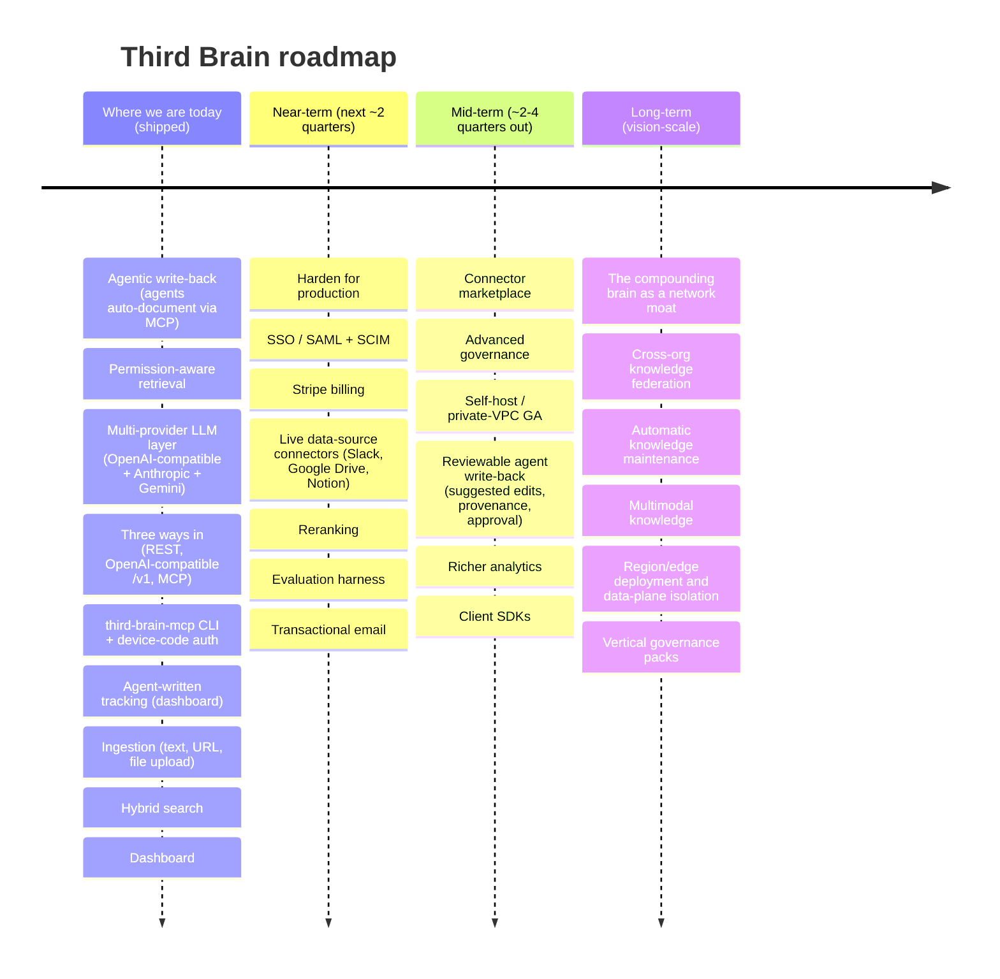

# Third Brain - Roadmap

> **The documentation writes itself.** This is the "what next." For the "why," see
> [`VISION.md`](./VISION.md); for the "how," see [`ARCHITECTURE.md`](./ARCHITECTURE.md).

This roadmap is directional, not a commitment of dates. Items ship when they clear our bar for
correctness - and, for anything in the retrieval path, the permission gate stays provably intact.
Current version: **1.0.2**.

The whole roadmap at a glance - each column is a section below:

---

## Where we are today (shipped)

The baseline the roadmap builds on - all of this is in the repo and covered by tests:

- **Agentic write-back (the documentation writes itself)** - agents connected over MCP call
  `add_knowledge` / `update_knowledge` to capture decisions, answers, and notes as they work.
  Writes pass through the same secret/DLP quarantine and the same permission model as everything
  else, so an agent only writes where it's allowed and never persists a leaked credential.
- **Permission-aware retrieval** - org → team → user RBAC plus per-collection and per-document
  ACLs, computed once per request and pushed into the SQL `WHERE` clause. A chunk you can't see
  never enters a prompt. This is the trust pillar the write-back path stands on.
- **Multi-provider LLM layer** - BYO-keys connectors for any OpenAI-compatible endpoint (OpenAI,
  Azure OpenAI, Ollama, vLLM, or any compatible gateway) plus native **Anthropic** and **Google
  Gemini**, all over plain `httpx` with no provider SDKs; a deterministic offline stub provider so
  the whole stack runs with zero keys.
- **Three ways in** - native REST API under `/api/v1`, an OpenAI-compatible `/v1` endpoint, and a
  first-class **MCP server** at `/mcp` with read *and* write tools (`search_knowledge`,
  `get_document`, `add_knowledge`, `update_knowledge`, `list_collections`).
- **`third-brain-mcp` CLI + device-code auth** - `npx third-brain-mcp connect` runs an OAuth-style
  device flow (short user code, admin approval at `/activate`, a scoped key minted once), and
  `install claude` / `cursor` / `claude-code` wire the brain into those clients in one command.
- **Agent-written tracking** - the dashboard Documents page carries an **Agent-written** filter and
  badge, and the Overview shows a **Written by agents** card, so a team can see exactly what its
  agents captured.
- **Ingestion** - text, URL, and file upload, chunked and embedded by arq workers into
  Postgres + `pgvector`.
- **Hybrid search** - vector similarity fused with keyword search via reciprocal rank fusion.
- **Dashboard** - usage analytics, spend, scoped API keys, teams, connectors, document management,
  and audit logs (Next.js 14).
- **Evaluation & load-test harnesses** - a golden-dataset retrieval + permission-correctness
  benchmark (`make benchmark`; exits non-zero on **any** permission leak - see
  `docs/BENCHMARKING.md`) and a Locust load test with pass/fail latency/error thresholds
  (`make load-test` / `make load-seed` - see `docs/LOAD_TESTING.md`). They run on demand today;
  wiring them into CI as release gates is near-term.

---

## Near-term (next ~2 quarters)

The focus: harden what exists, then unlock the two things that gate revenue - enterprise auth and
billing - and the two things that gate retrieval quality - live connectors and better ranking.

- **Harden for production.** Tighten rate-limit and quota enforcement per tier, expand test
  coverage on the permission boundary, structured audit events for every write, background-job
  retries/dead-lettering, and running the existing load/soak harness on a schedule.
- **SSO / SAML + SCIM.** Enterprise identity: SAML 2.0 and OIDC login, SCIM user/group
  provisioning, and mapping IdP groups to Third Brain teams so ACLs stay in sync automatically.
  *(Enterprise tier - not yet shipped.)*
- **Stripe billing.** Metered + seat-based subscriptions, self-serve Free → Pro upgrade, invoices,
  and enforcement of tier limits at the billing boundary. Today the tier *limits* are
  *documented* (pricing page / VISION) but not yet *defined in code* or *enforced*; this adds
  both their definition and enforcement, plus the automated *charging*. *(Not yet shipped.)*
- **Live data-source connectors - Slack, Google Drive, Notion.** Incremental sync that ingests
  from source systems and, critically, **maps source-side permissions onto Third Brain ACLs** so
  the permission gate holds end-to-end. This is the first move beyond files/URLs/text ingestion.
- **Reranking.** A cross-encoder / LLM reranking stage on top of hybrid retrieval to lift
  precision@k on the shortlist before it reaches the model.
- **Gate releases on the eval harness.** The retrieval-quality *and* permission-correctness eval
  already exists (`make benchmark`); the near-term work is wiring it into CI so every release is
  blocked on it - the permission suite is non-negotiable, since a single leaked chunk destroys
  trust - and publishing the permission-correctness benchmarks.
- **Transactional email.** Verification, password reset, invites, and billing notifications.
  *(Not yet shipped.)*
- **Runtime web configuration.** Move the web client's API base URL from the build-time
  `NEXT_PUBLIC_API_URL` to server-provided runtime config, so one published web image can serve
  any deployment instead of being baked per-origin.

## Mid-term (~2–4 quarters out)

- **Connector marketplace.** GitHub, Confluence, Jira, Linear, Zendesk, Salesforce, and a stable
  connector SDK so third parties can add sources - every connector carries its permission mapping.
- **Advanced governance.** Retention/expiry policies, data-residency controls, PII detection and
  redaction, per-collection encryption, and legal-hold.
- **Self-host / private-VPC.** Third Brain is managed-only for now; self-hosting - a supported,
  documented deployment that runs entirely inside the customer's perimeter while keeping the
  managed experience - is deferred until we're resourced to support it well (post-funding).
- **Reviewable agent write-back.** Agents already write back today (`add_knowledge` /
  `update_knowledge`, gated by permissions and the secret scanner). The mid-term layer adds
  structure on top: suggested edits, richer provenance, and human-in-the-loop approval queues so
  higher-stakes contributions can be reviewed before they land.
- **Richer analytics.** Retrieval-quality dashboards, coverage/gap analysis ("what does nobody
  have an answer for?"), and cost attribution by team and workspace.
- **Client SDKs.** First-class Python and TypeScript SDKs with typed clients, streaming, and MCP
  helpers. The `third-brain-mcp` CLI shipped first as the fastest way to wire agents in; typed
  SDKs are the next layer for teams building directly against the REST/OpenAI-compatible surfaces.

## Long-term (vision-scale)

- **The compounding brain as a network moat.** A deduplicated, permission-tagged knowledge graph
  per deployment that gets more valuable - and more expensive to leave - the longer it runs.
- **Cross-org knowledge federation.** Opt-in, permission-preserving sharing between organizations
  (e.g. a company and its vendors) without collapsing either side's ACLs.
- **Automatic knowledge maintenance.** Staleness detection, conflict resolution across sources, and
  proactive "this doc contradicts that one" surfacing.
- **Multimodal knowledge.** Images, audio, and video ingested, embedded, and retrieved under the
  same permission gate.
- **Region/edge deployment & data-plane isolation** for the most regulated buyers (fintech, health,
  legal, public sector).
- **Vertical governance packs.** Prebuilt policy, retention, and compliance templates (HIPAA, SOC 2,
  FedRAMP-aligned) that shorten security review from months to days.

---

## How we prioritize

1. **Permission correctness first.** Anything touching retrieval ships behind the eval harness;
   the permission gate never regresses.
2. **Revenue unlocks next.** SSO/SAML and Stripe billing convert the demand the OSS motion creates.
3. **Retrieval quality compounds.** Connectors and reranking make the brain worth plugging every
   model into - which drives the write-back loop and the moat.

Have a request or a source you need connected? Open an issue - the roadmap is shaped by what teams
actually hit the governance wall on.
