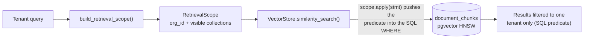
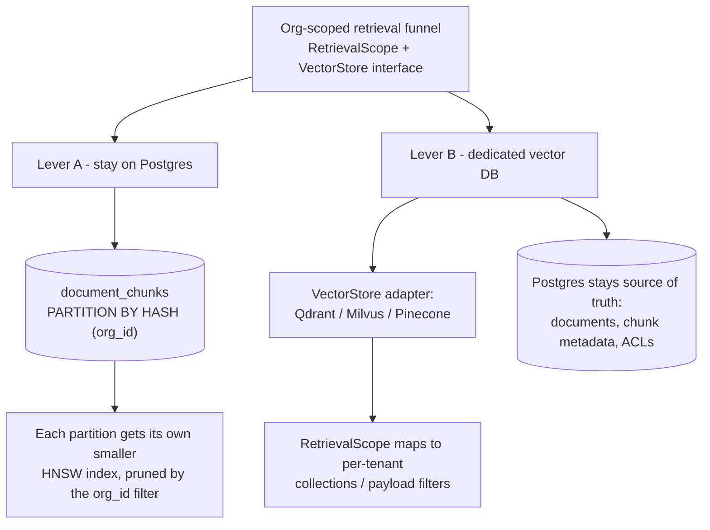
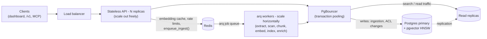

# Scaling Third Brain

How the architecture holds up from thousands to **hundreds of millions of documents**, what
the real limits are, and the concrete levers to pull. No hand-waving - the numbers below are
the ones that actually govern a pgvector-backed, multi-tenant retrieval system.

## The one insight that makes it scale

**Every retrieval is org-scoped, and usually collection-scoped.** No query ever searches
across all tenants - `build_retrieval_scope()` pushes `org_id` (and the caller's visible
collection/document set) into the SQL `WHERE` clause before the vector search runs. So the
*result set for any single query is one tenant's data*, not the global corpus.



One caveat: on the default single shared HNSW index, the ANN candidate scan itself is still
global - the org predicate is applied as an iterative post-filter (pgvector >= 0.8 iterative
scans, with `ef_search` widened per query; see `pgvector_store.py`) - so only the result set is
guaranteed tenant-only. A query over 100M documents spread across 10,000 tenants truly behaves
like a ~10k-doc search once the index narrows per tenant: partition `document_chunks` by `org_id`
(Lever A below) or use per-tenant collections in a dedicated store (Lever B). Scaling is therefore
about (a) keeping each tenant's index small and fast, and (b) spreading tenants across storage.
Both are standard, and the code is already written for them (retrieval goes through the
`VectorStore` interface + `RetrievalScope`).

## Where the volume is

Everything hangs off one hot table: **`document_chunks`** (one embedded row per chunk).
At ~3-5 chunks per document, 100M documents ≈ **0.3-0.5B chunks**. Sizing is dominated by the
embedding vectors:

| Embedding dim (float32) | Bytes/vector | 1M chunks | 10M | 100M | 500M |
|---|---|---|---|---|---|
| 1536 (`text-embedding-3-small` default) | ~6.3 KB | ~6 GB | ~63 GB | ~630 GB | ~3 TB |
| 512 (same model, `dimensions=512`) | ~2.1 KB | ~2 GB | ~21 GB | ~210 GB | ~1 TB |

HNSW keeps its graph in memory for low-latency search, so **RAM is the binding constraint**.
First lever, before any infrastructure: **use smaller embeddings.** `text-embedding-3-*` models
support a `dimensions` parameter; dropping 1536 → 512 cuts memory ~3× for a small recall hit.
Set `EMBEDDING_DIM` accordingly (it must match the model output) and re-index.

## Regime 1 - single-node pgvector (up to ~tens of millions of chunks)

This is the default and covers the vast majority of real deployments (thousands of tenants,
millions of docs). Tuning that matters:

- **HNSW index** (already created by the baseline migration):
  `m`, `ef_construction` at build time; `hnsw.ef_search` at query time trades recall vs latency.
- **pgvector ≥ 0.8** - *iterative index scans* make filtered ANN (our `org_id`/collection filter)
  much better; keep pgvector current.
- **Postgres memory**: raise `maintenance_work_mem` for index builds, `work_mem` for query sorts,
  and size `shared_buffers`/`effective_cache_size` so the working set stays in RAM.
- **Redis cache** (already wired): query embeddings are cached, so repeated or paginated
  searches skip re-embedding (the vector/ANN scan still runs on every query).

Rule of thumb on a large managed instance: comfortable to ~single-digit millions of 1536-d
vectors, low-tens of millions with 512-d + tuning. Past that, go to Regime 2.

## Regime 2 - hundreds of millions of documents (billions of chunks)

A single HNSW index over billions of vectors is not the right tool - the graph won't fit in one
box's RAM. Two proven levers, and the code already supports both:



### Lever A - partition `document_chunks` by tenant (stay on Postgres)

Because queries always filter by `org_id`, hash-partition the chunk table on `org_id`. Each
partition gets its own (smaller) HNSW index, index builds parallelize, and the planner prunes to
the relevant partition. Example:

```sql
-- Recreate document_chunks as a HASH-partitioned table (org_id is the partition key).
CREATE TABLE document_chunks (LIKE document_chunks_old INCLUDING ALL) PARTITION BY HASH (org_id);
CREATE TABLE document_chunks_p0 PARTITION OF document_chunks FOR VALUES WITH (MODULUS 16, REMAINDER 0);
-- … p1 … p15
-- Build the HNSW + FTS index on each partition (parallelizable):
CREATE INDEX ON document_chunks_p0 USING hnsw (embedding vector_cosine_ops) WITH (m = 16, ef_construction = 64);
```

The application needs **no change** - SQLAlchemy inserts/selects route transparently, and the
`org_id` filter drives partition pruning. Apply the same partitioning to the other append-heavy
tables (`usage_records`, `audit_logs`) - partition those by time (monthly) and drop old partitions
cheaply.

For a single *mega-tenant* whose data alone exceeds a node, shard that tenant across sub-partitions
(e.g. by `collection_id`) or move it to Lever B.

### Lever B - dedicated vector database via the existing abstraction

Retrieval only ever calls `get_vector_store().similarity_search(db, scope, embedding, top_k)`.
Implement `VectorStore` against **Qdrant, Milvus, or Pinecone** (built for billions of vectors
with metadata filtering) and point the factory at it. Postgres stays the source of truth for
documents, chunks-metadata, and ACLs; the vector index scales out separately. Our org-scoped
`RetrievalScope` maps directly onto per-tenant collections / payload filters in those systems, so
permission enforcement is preserved. **This is a config/adapter change, not a rewrite** - which is
exactly why the interface exists.

## Scaling the rest of the stack

Where load lands once you scale out:



- **Stateless API** - auth is JWT + hashed API keys; all shared state is in Postgres/Redis. Run N
  API replicas behind a load balancer and scale out freely.
- **Connection pooling** - put **PgBouncer** (transaction pooling) in front of Postgres; async
  workers + many API replicas will otherwise exhaust connections.
- **Read replicas** - route search/read traffic to replicas; keep writes (ingestion, ACL changes)
  on the primary.
- **Ingestion throughput** - uploads return immediately; extract → scan (secrets, DLP) → chunk →
  embed → index → enrich runs on **arq workers**. Scale workers horizontally; embeddings are
  batched per document (96 chunks per provider call); the queue provides natural backpressure.
  The Redis embedding cache applies to search-time query embeddings only (see Regime 1).
- **Rate limiting** - per-key fixed 60-second window in Redis; already stateless-friendly.

## Known code-level optimizations for very large tenants

These are correct-but-not-yet-optimized spots, called out honestly:

- **Visible-collection resolution** (`permissions.build_retrieval_scope`) scans an org's collections
  per request. Fine for orgs with hundreds/thousands of collections; for orgs with *very* many,
  cache the computed visible-collection set in Redis per `(user, org)` and invalidate on grant/visibility
  changes (the Redis cache layer is already present).
- **Deep pagination** - document/audit lists use `OFFSET/LIMIT`, which degrades at very deep pages.
  Switch to **keyset (cursor) pagination** on `(created_at, id)` for tenants with millions of docs.

## Decision guide

| Scale (documents) | Recommended setup |
|---|---|
| ≤ ~1M | Default single-node Postgres + pgvector. Nothing to do. |
| ~1M - ~20M | Single node, 512-d embeddings, tuned HNSW/`work_mem`, PgBouncer, a read replica. |
| ~20M - ~100M+ | Partition `document_chunks` by `org_id` (Lever A) + replicas + worker autoscaling. |
| Hundreds of millions / mega-tenants | Dedicated vector DB via the `VectorStore` interface (Lever B); Postgres remains system of record. |

The design goal is that moving between these regimes is **operational** (config, partitions, an
adapter) rather than a rewrite - because retrieval is already funneled through one org-scoped,
store-agnostic path.
