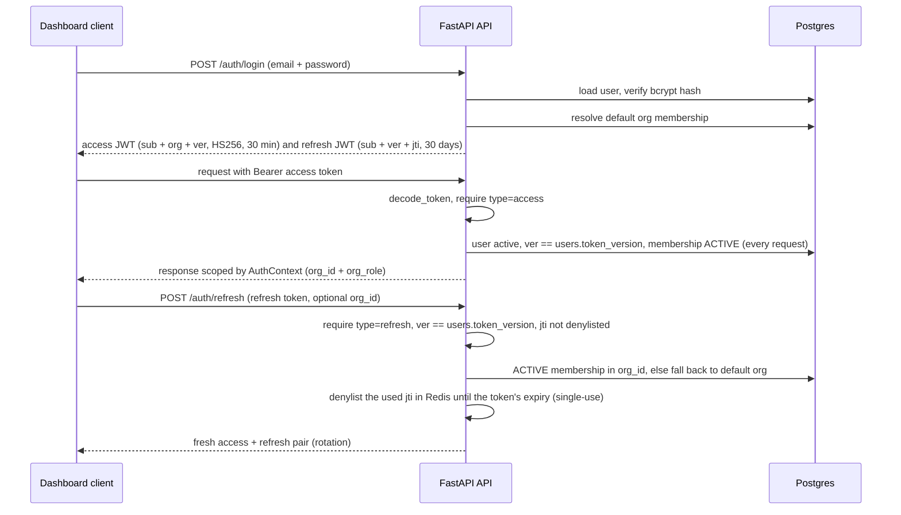
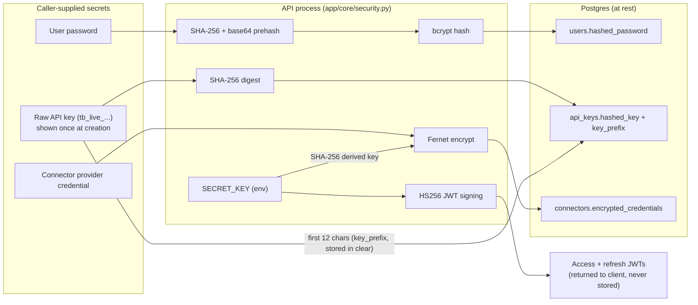

# Security

Third Brain is a governed knowledge layer: its core promise is that **you can never
retrieve a chunk you are not allowed to see** - not through the API, not through search,
and not indirectly through an LLM prompt. This document describes the threat model, how
secrets are handled, and how to report a vulnerability.

- [Reporting a vulnerability](#reporting-a-vulnerability)
- [Threat model](#threat-model)
- [Trust boundaries](#trust-boundaries)
- [Authentication & sessions](#authentication--sessions)
- [Authorization](#authorization)
- [Secret handling](#secret-handling)
- [Secret scanning & quarantine](#secret-scanning--quarantine)
- [DLP / sensitivity scanning](#dlp--sensitivity-scanning)
- [Tenant isolation](#tenant-isolation)
- [Rate limiting & abuse](#rate-limiting--abuse)
- [Auditing](#auditing)
- [Data handling](#data-handling)
- [Data residency & self-hosting](#data-residency--self-hosting)
- [Hardening checklist](#hardening-checklist)

---

## Reporting a vulnerability

**Please do not open a public issue for security problems.**

Report privately through **GitHub private vulnerability reporting**:
<https://github.com/km322/Third-Brain/security/advisories/new>. It is the fastest channel
and keeps the report private until a fix ships.

Include:

- a description and impact assessment,
- reproduction steps or a proof of concept,
- affected version / commit,
- your contact for follow-up.

[`.github/SECURITY.md`](../.github/SECURITY.md) is the canonical policy: acknowledgement
**within 7 business days**, best effort rather than a contractual SLA, since this is a
volunteer-maintained project. Disclosure is coordinated - please allow a **90 day** target window
for a fix before going public - and reporters who want to be named are credited in the advisory
and the changelog.

Third Brain is self-hosted software: test only against an instance **you** run, and never access,
modify or exfiltrate anyone else's data while testing.

---

## Threat model

Assets we protect, in priority order:

1. **Tenant knowledge** - documents, chunks and their embeddings.
2. **Permissions integrity** - the ACL graph that decides who sees what.
3. **Credentials** - passwords, API keys, and per-org connector provider secrets.
4. **Usage-metering and audit records**.

Adversaries we design against:

| Adversary | Example goal | Primary control |
|---|---|---|
| Unauthenticated internet user | Read any data | Auth required on every data route. The unauthenticated surface is small and deliberate: health/version probes (no tenant data); the two device-auth endpoints (start, poll); the SSO discovery/start/callback/ACS endpoints; `POST /api/v1/invites/accept` (rate limited per token and client IP; a valid, unexpired, unused token provisions the account and signs in, and only ever a **new** one - an address that already has an account gets `409`, never a session); and `GET /api/v1/files/{token}`, a capability URL serving an image document's original bytes to any holder of an unguessable 256-bit token (rate limited on misses, raster-image media-type whitelist, quarantined documents 404). `public` collections are still org-scoped (any org member or org API key), not internet-public. Auth endpoints are per-identifier rate limited against brute force. |
| Authenticated org member | Read a document they weren't granted | Permission engine enforced at retrieval time (SQL pushdown). |
| Cross-tenant attacker | Read another org's data | Every query filters by `org_id`; resources 404 across org boundaries. |
| Malicious/leaked API key | Escalate privilege via impersonation | Keys carry scopes + fixed org; **keys cannot mint or revoke keys**; `acts_as_user_id` must be an existing org member. |
| Device-auth code interception | Redeem someone's CLI sign-in for a key | The two unauthenticated device endpoints are rate limited; the secret device code is stored only as a **hash**, codes **expire**, and each is **single-use**; approval is **admin-only** and the minted key cannot outrank the approver; the key is returned exactly once. |
| Prompt-injection via ingested content | Trick the LLM into leaking out-of-scope chunks | Retrieval scope is computed **before** generation; only in-scope chunks ever enter the prompt. |
| Insider reading secrets at rest | Recover a connector's provider key | Connector credentials encrypted at rest (Fernet); never returned by the API. |

Out of scope for this document: physical security of your infrastructure, the security of
third-party LLM providers you configure, and DoS at the network layer (use a WAF/CDN).

---

## Trust boundaries

```
  Untrusted             │  Semi-trusted             │  Trusted
  browser / API / MCP   │  API process (validates,  │  Postgres, Redis,
  client / LLM output   │  authorizes, meters)      │  object storage, provider keys
```

All input crossing the first boundary is validated by Pydantic schemas and authorized by the
permission engine. **LLM output and ingested document content are treated as untrusted**: they
influence answers but never widen the retrieval scope.

---

## Authentication & sessions

Two paths converge on a single `AuthContext`
([`app/core/deps.py`](../apps/api/app/core/deps.py)):

- **JWT sessions** (dashboard). Short-lived **access tokens** (default 30 min) carry the
  active `org`; longer-lived **refresh tokens** are user-scoped, **single-use** (each
  carries a unique `jti`) and rotated on every exchange. Both token types embed the
  user's current `token_version` as `ver`. Signed with `SECRET_KEY` (`HS256`). Passwords
  are hashed with **bcrypt** (`app/core/security.py`).
- **API keys** (programmatic / OpenAI-compat / MCP). Generated with a `tb_` prefix; only the
  **prefix + a SHA-256 hash** are stored - the raw secret is shown exactly once at
  creation and is unrecoverable afterward (one bounded exception for device-flow keys -
  see [Secret handling](#secret-handling)). Keys carry **scopes**, a fixed **org**, an
  optional **expiry**, and a per-minute **rate limit**.
- **Device authorization** (the `third-brain-mcp` CLI sign-in). An OAuth-style device flow
  mints an API key without the user ever pasting one: the two device endpoints (start and
  poll) are unauthenticated but **rate limited**, the secret **device code** is stored only as
  a **hash**, codes **expire** and are **single-use**, and a code becomes a key only after an
  **admin** approves it from `/activate`. The minted key defaults to the `search`/`read`/`ingest` scopes, acts as
  the approving admin (or a chosen member who may not outrank them, so approval never escalates
  privilege), and is returned exactly once - the same one-shot handling as any API key.

The SCIM provisioning surface sits outside those paths: `/api/v1/scim/v2/*` authenticates with
its own bearer token (see [Secret handling](#secret-handling)), which resolves to the issuing
org rather than to an `AuthContext`, and it reaches nothing but the SCIM user/group routes.

The JWT session lifecycle end to end (`app/api/routes/auth.py`, `app/core/deps.py`):



**Where the dashboard keeps its tokens - an accepted trade-off.** Both the access and refresh
tokens live in `localStorage` ([`apps/web/lib/api.ts`](../apps/web/lib/api.ts)), which is what
keeps you signed in across a page reload without a cookie session. The cost, stated rather than
hidden: any script running on the dashboard's origin can read both, and the refresh token is valid
for `REFRESH_TOKEN_EXPIRE_DAYS` (30 by default). Single-use rotation stops a *replayed* copy but
not a thief who rotates the token themselves, so a dashboard XSS is a month of access rather than
30 minutes. [`apps/web/next.config.mjs`](../apps/web/next.config.mjs) sets `X-Frame-Options: DENY`,
`nosniff`, a referrer policy and `frame-ancestors 'none'`, but **deliberately no `script-src`
policy**: Next.js relies on inline and hashed scripts and a strict policy needs per-build nonces,
so CSP is not a second line of defence here. If dashboard XSS is in your threat model, shorten
`REFRESH_TOKEN_EXPIRE_DAYS`; a password change or admin reset bumps `token_version` and
invalidates every outstanding token at once.

Session revocation is layered:

- **Refresh rotation (single-use tokens).** Exchanging a refresh token - or surrendering it via
  `POST /auth/logout` with the optional `{"refresh_token": ...}` body - denylists its `jti` in
  Redis until the token's natural expiry, so a replayed or stolen refresh token gets a 401.
  Caveat: the denylist **fails open** on a Redis outage, matching the rate limiter's policy, since
  a downed denylist must not lock every user out of refreshing; single-use enforcement lapses for
  the duration. Logout is always audited.
- **Token versioning.** Every JWT embeds the user's `token_version` as `ver`, re-checked against
  the database on each authenticated request and on refresh. A password change or admin password
  reset increments the version and instantly revokes all of that user's outstanding tokens.
- **Secret rotation.** Rotating `SECRET_KEY` invalidates all outstanding JWTs (note the
  [secret-handling caveat](#secret-handling) - it also affects connector decryption).

Password lifecycle endpoints are **session-only**; API keys are rejected outright:

- `POST /auth/change-password` verifies the current password, enforces the registration
  password policy on the new one, bumps `token_version`, and returns a fresh token pair
  minted with the new version so the caller stays signed in while every other session
  dies. It is rate limited like login.
- `POST /orgs/members/{id}/reset-password` (admin or owner) sets a temporary password
  (`secrets.token_urlsafe`, returned exactly once, only its bcrypt hash stored) and bumps the
  target's `token_version`. Rules: only an owner may reset an owner; you cannot reset yourself
  (use change-password); and the reset is refused with 409 unless this org is the target's only
  organization. Any membership elsewhere - active, invited or suspended - blocks it, because the
  temporary password is a global credential an admin could later use against that other tenant;
  such users must reset from their own account or through support.

---

## Authorization

Authorization is centralized in
[`app/services/permissions.py`](../apps/api/app/services/permissions.py) - see
[`PERMISSIONS.md`](./PERMISSIONS.md) for the full model. The critical property:

> The same engine authorizes **routes** *and* builds the **retrieval scope**. The scope is
> pushed into the SQL `WHERE` clause over `document_chunks`, so an out-of-scope chunk can
> never appear in a search result - and therefore never in an LLM prompt or citation.

Effective permission is the **maximum** of org-role baseline, ownership, visibility
baseline, and explicit user/team grants (documents also inherit from their collection).
Levels are ordered `none < viewer < editor < manager`.

**API-key privilege**: a key's effective role is derived from its scopes (`manage`/`*` →
admin; `write`/`ingest` → editor; otherwise viewer) unless it is bound to a real member via
`acts_as_user_id`, in which case that member's role applies. Key management endpoints
require a **human admin session** - API keys cannot create or revoke keys, closing an
impersonation/privilege-escalation path.

---

## Secret handling

| Secret | At rest | In transit | Exposure |
|---|---|---|---|
| User password | bcrypt hash | TLS | Never returned. |
| API key | SHA-256 hash + prefix (see exposure) | TLS | Raw secret shown **once** at creation. One exception: a device-auth-minted key is held Fernet-encrypted in `device_authorizations.encrypted_secret` between admin approval and the CLI's redeeming poll (at most 15 minutes), then nulled on redemption or expiry - an expired flow also revokes the orphan key. |
| JWT signing | n/a (`SECRET_KEY`) | TLS | Never returned. |
| Connector provider credentials | **Fernet-encrypted** blob (key derived from `SECRET_KEY`) | TLS | Never serialized; decrypted transiently only to make a provider call. `has_credentials` indicates presence without revealing the value. |
| SCIM provisioning token | SHA-256 hash + prefix | TLS | Raw `scim_…` token shown **once** at creation; authenticates `/api/v1/scim/v2/*` only, scoped to the issuing org. |
| SSO connection `client_secret` | **Fernet-encrypted** (key derived from `SECRET_KEY`) | TLS | Never returned; `has_secret` reports presence only. |
| Image capability token | plaintext in `documents.metadata.file_token` (256-bit random) | TLS | Embedded in the image document's indexed chunk text so a retrieving LLM can fetch the picture; possession grants unauthenticated read of that one image's bytes. |

Every credential is transformed inside the API process before it reaches Postgres, and
`SECRET_KEY` sits behind both JWT signing and connector encryption - which is why rotating
it invalidates both (`app/core/security.py`):



Operational guidance:

- Set `SECRET_KEY` to **32+ bytes of entropy** from a secret manager. Do **not** use the
  default `change-me`.
- **`SECRET_KEY` rotation is coupled to connector encryption.** Rotating it invalidates all
  JWTs *and* renders previously stored connector credentials and SSO client secrets
  undecryptable - re-enter those secrets after rotation. Plan rotations accordingly.
- Never commit `.env` (it is git-ignored) or bake secrets into images. Inject via your
  orchestrator's secret store.
- Provider keys can be global (env) or per-org **Connectors**; the latter keeps each
  tenant's provider spend and credentials isolated.

---

## Secret scanning & quarantine

Ingested content is scanned for embedded credentials (AWS access key ids, private-key
blocks, GitHub tokens, and similar patterns) BEFORE it is chunked, embedded, or indexed
(`app/services/secret_scan.py`). A flagged document is parked at status `quarantined`
instead of being indexed, and a `document.quarantined` audit entry is recorded.
Quarantined content is never searchable: retrieval excludes `quarantined` documents
inside the SQL query (`Document.status != 'quarantined'`), so even chunks left over from
a previously indexed version of the document cannot surface in a search result, an LLM
prompt, or a citation. (Non-quarantine states such as a mid-reprocess `pending` or a
`failed` reprocess keep any previously indexed chunks searchable, matching pre-scan
behaviour; chunks only ever exist from a prior successful index.)

An editor then decides the document's fate from the dashboard Documents page:

- **Review** (`GET /api/v1/documents/{id}/review`) shows WHAT was detected (detector,
  severity, occurrence counts, and **redacted** samples), WHICH collection the document
  would land in, and WHO would gain access. The audience is **document-aware**: it uses
  the document's own visibility override when set (so an `org` document in a PRIVATE
  collection correctly shows the whole org, and a stricter override drops the
  visibility-derived reach) and includes document-level grants alongside collection
  grants, ownership, and org admins. Per-user identities (names + emails) are returned
  only to callers who **manage the collection or are org admins** - matching the
  admin-only member list and manager-only grants list; other editors receive the
  aggregate `permission_counts` (`viewer`/`editor`/`manager`) and a note, never the
  identities.
- **Approve** (`POST /api/v1/documents/{id}/approve`, "index anyway") stamps an approval
  keyed to the content's **checksum**, re-queues ingestion, and records
  `document.quarantine_approved`. Re-ingesting unchanged content then indexes normally;
  any content change invalidates the approval and quarantines the document again. Approve
  serializes against any in-flight ingest on a Postgres advisory lock so a redelivered
  ingest job cannot re-quarantine the row and clobber the fresh approval stamp.
- **Discard** (`DELETE /api/v1/documents/{id}`) deletes the document as usual.

A quarantined document can leave that state **only** through review: `POST
/api/v1/documents/{id}/reprocess` returns `409` while a document is quarantined (it would
otherwise flip to `pending` and briefly re-expose leftover chunks), directing the caller
to approve or discard instead.

MCP writes pass through the same scanner: `add_knowledge` persists a flagged document as
quarantined (source blob and checksum stored, nothing indexed) and tells the calling
model why; `update_knowledge` rejects a flagged update outright, leaving the stored
document unchanged.

Only metadata is ever persisted or logged: detector names, counts, line numbers, and
redacted samples (at most the first four and last two characters; private-key matches
use a fixed placeholder). The raw secret never appears in the document's `metadata`
column, API responses, audit entries, or logs. Scanning is on by default; set
`SECRET_SCAN_ENABLED=false` to disable it (not recommended).

---

## DLP / sensitivity scanning

A second pass classifies ingested content as `none`, `pii`, or `confidential`
(`app/services/dlp_scan.py`, `DLP_ENABLED` on by default). It follows the same rules as the
credential scanner - raw values never leave the scanner, samples are redacted, every pattern
is linear-safe - and it is a heuristic classifier, not a compliance-grade DLP engine.

`DLP_DEFAULT_ACTION` decides what a DLP-only hit does:

- `label` (the default) - index normally and tag the document's `sensitivity`.
- `quarantine` - park the document for review, under the same checksum-keyed approval as a
  secret hit.
- `warn` - index and record the finding, leaving the label unchanged.

A document flagged by the ingestion worker records a `document.sensitive` audit entry with
the action taken; on the MCP write path only the quarantine outcome is audited. The
admin-only **Oversharing** report (`GET /api/v1/governance/oversharing`, the dashboard
Oversharing page) then lists documents classified `pii`/`confidential` whose effective
visibility is `org` or `public`, so access can be tightened. It is read-only: remediation is
done by changing visibility or grants through the normal surfaces.

One gap to know about: the review payload's `findings` list is populated by the secret
scanner only, so a document quarantined by DLP alone reviews with an empty list.

---

## Tenant isolation

Every tenant table is scoped to an `organization` - `users` is the one global identity
table - and **every query for tenant data filters by `ctx.org_id`**. Cross-org access
returns `404` (not `403`) so existence isn't leaked across tenants. The retrieval scope is
always constructed with the caller's `org_id` first, then narrowed by permissions. Uploaded
files should live on per-deployment object storage (`STORAGE_BACKEND=s3`) with bucket
policies scoped to the app role.

---

## Rate limiting & abuse

Every authenticated principal has a per-minute limit enforced in Redis (fixed 60-second
bucket); exceeding it returns `429`. API keys are metered per key at that key's configured
budget (`DEFAULT_RATE_LIMIT_PER_MINUTE` for new keys, tighter for untrusted integrations);
dashboard sessions are metered per user at `SESSION_RATE_LIMIT_PER_MINUTE`. Sessions are
metered because several endpoints (search, chat, ingestion) spend real provider tokens - an
unmetered signed-in caller could otherwise bill the operator without limit. The
unauthenticated auth endpoints have their own per-(identifier, IP) brute-force guard.

**Self-serve signup is closed by default in production** - a safety default for you, the operator,
not a gate on the software. A newly registered org has no connector of its own, so its completions
and embeddings fall back to the deployment's platform provider keys: open registration on a
reachable instance lets any stranger who finds it spend **your** OpenAI / Anthropic / Gemini
budget. `POST /auth/register` therefore returns `403` when `ENVIRONMENT=production` unless
`SIGNUP_ENABLED=true` is set explicitly.

Bring members in deliberately instead:

- **Invite them** from the dashboard (`POST /api/v1/invites`), which is the normal path. The
  accept link travels only by email and is deliberately never returned by the API or shown in
  the dashboard, so configure `EMAIL_PROVIDER=smtp` first - on the default `stub` the invite
  is created but never delivered (see [`DEPLOYMENT.md`](./DEPLOYMENT.md#configuration)).
- **Provision them through SSO/SCIM** if you run an IdP.
- **Or open registration on purpose** with `SIGNUP_ENABLED=true` - reasonable when the
  instance is only reachable inside your network, when every org configures its own
  connector, or when you simply accept the provider spend. If you open it on a publicly
  reachable instance, keep `DEFAULT_RATE_LIMIT_PER_MINUTE` /
  `SESSION_RATE_LIMIT_PER_MINUTE` tight and watch `usage_records`.

Put a WAF/CDN in front for volumetric DoS and IP reputation. Metering (`usage_records`)
also makes runaway spend visible quickly.

---

## Auditing

Security-relevant actions are recorded to `audit_logs`: logins/logouts, password
changes and admin password resets, API-key create/revoke, permission grant/revoke,
document create/delete/access, collection creation and searches. Entries capture the actor,
resolved email (when available), user-agent, and the **peer address of the connection**.
Audit reads require an **admin** session (`GET /api/v1/analytics/audit`). Treat the audit log
as append-only and ship it to durable, tamper-evident storage.

> **The recorded address is the direct peer, not necessarily the end user.** `client_ip()`
> ([`app/core/deps.py`](../apps/api/app/core/deps.py)) returns `request.client.host`; nothing
> in the stack consumes `X-Forwarded-For`, and uvicorn is started without `--proxy-headers`.
> In both documented public topologies - a Cloudflare Tunnel, or your own TLS-terminating
> reverse proxy - the API's peer is that proxy, so **every audit row records the proxy's
> address rather than the user's**. Do not read audit IPs as user attribution; your proxy's
> access log (or Cloudflare's `CF-Connecting-IP`) is the record of record for now.
>
> The login rate limiter is keyed on `(email, client IP)`, so a constant peer address degrades it
> to a purely per-account limit. That is not a bypass: the per-account half still caps credential
> stuffing against one account at 10 attempts a minute, and per-IP was never a defence against
> spraying across many accounts, since each `(email, IP)` pair gets its own bucket either way. The
> visible effect runs the other way - users sharing the proxy share a bucket, so repeated failures
> against one account throttle every client behind it.

---

## Data handling

- **In transit**: terminate TLS at your proxy/LB; use `rediss://` and TLS to Postgres.
- **At rest**: enable disk encryption on your Postgres, Redis and object storage.
- **Third parties**: query text and document content are sent to whichever LLM provider you
  configure. Choose providers/regions consistent with your data-residency and DPA
  requirements; per-org Connectors let tenants pick their own (including self-hosted /
  OpenAI-compatible endpoints that never leave your network).
- **Deletion**: deleting a document removes its chunks/embeddings; deletion of originals in
  object storage follows your bucket lifecycle policy.

---

## Data residency & self-hosting

Third Brain runs entirely on infrastructure you control; there is no hosted service, so
self-hosting is the only way it runs. All data - documents, chunks, embeddings, permissions, usage
metering and the audit log - stays in **your** Postgres, Redis and upload directory, and no one
else holds a copy. A default deployment makes **no phone-home calls**: telemetry is opt-in (nothing
is exported unless you set `OTEL_EXPORTER_OTLP_ENDPOINT`), the offline stub means zero LLM calls
until you configure a key, and storage is local. The only outbound traffic goes to the LLM
providers and data sources **you** configure, plus user-triggered, SSRF-gated URL ingestion. You
choose the region and jurisdiction where the data lives.

See [`SELF_HOSTING.md`](./SELF_HOSTING.md) for the deployment guide, the verifiable
"nothing phones home" guarantee, and how compliance obligations follow data custody.

---

## Hardening checklist

- [ ] Strong, secret-managed `SECRET_KEY`; understand the rotation coupling above.
- [ ] TLS on all external traffic; `BACKEND_CORS_ORIGINS` restricted (never `*`).
- [ ] Postgres/Redis on a private network, encrypted, least-privilege roles.
- [ ] Per-key scopes minimal; short expiries; tight rate limits on untrusted keys.
- [ ] `SIGNUP_ENABLED` left unset (or `false`) unless you intend strangers to self-register
      and spend your provider keys; invite or SSO-provision members instead.
- [ ] `SESSION_RATE_LIMIT_PER_MINUTE` sized to your expected dashboard usage.
- [ ] `STORAGE_BACKEND=s3` with scoped bucket policy + versioning.
- [ ] Audit logs shipped to durable storage; access reviews scheduled.
- [ ] Dependencies patched; CI green (lint + build + `/api/v1/health` smoke test).
- [ ] Backups + tested restores; incident + disclosure contacts documented.
