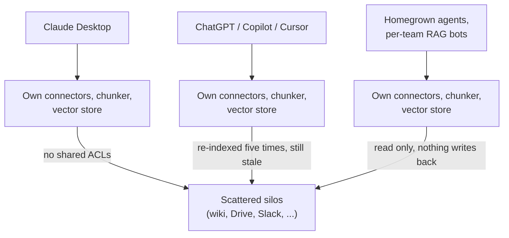
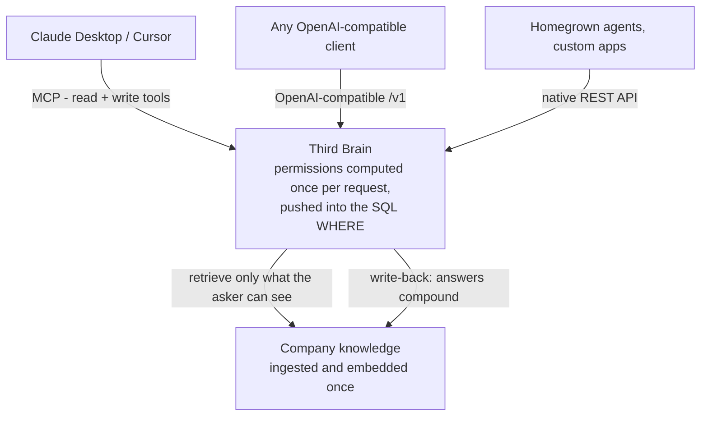

# Third Brain - Vision

> **The documentation writes itself.** A governed, model-agnostic company brain that your LLM
> tools fill in as they work - captured once, permission-scoped, searchable by every model.

This document is the "why." For the "how," see [`ARCHITECTURE.md`](./ARCHITECTURE.md); for the
"what next," see [`ROADMAP.md`](./ROADMAP.md).

---

## Problem

Every company is now running a dozen LLM surfaces at once - Claude Desktop, Claude Code,
ChatGPT, Cursor, homegrown agents, per-team RAG bots. An enormous amount of a company's real
knowledge is now *created inside those sessions* - a decision reasoned out in a Claude thread, an
answer an agent worked out, a runbook figured out with Cursor. Each surface re-solves the same
three problems badly:

1. **Nothing writes back, so the knowledge evaporates.** Answers, decisions, and new facts vanish
   at the end of the chat. Nobody writes the doc, because writing the doc is the boring part
   nobody has time for. The same questions get re-answered and the same decisions re-litigated,
   and institutional memory stays trapped in closed tabs and people's heads.
2. **There is no shared permission model.** A model wired to the company wiki has no idea that
   *this* asker can't see the comp doc or the unreleased roadmap. So security either says "no"
   or looks the other way. Both are bad.
3. **Retrieval is rebuilt from scratch, everywhere.** Every tool ships its own connectors,
   chunker, and vector store. Knowledge is re-indexed five times and still stale in all five.

The result: LLMs feel magical in a demo and useless at work, because at work the hard part isn't
generation - it's *capturing what the work produces and governing who can see it*.

## Why now

- **MCP made agents able to *write*, not just read.** For the first time, one backend can serve
  every LLM client through interfaces they already speak - and, critically, expose write tools
  the agent calls as it works. That's what turns "capture the knowledge" from a nagging chore
  into something the tools do themselves. A neutral, self-populating knowledge layer is finally
  buildable without per-client integrations.
- **Embeddings + pgvector got cheap and good enough.** Permission-filtered semantic search over
  millions of chunks now runs on commodity Postgres, not a specialized vector DB fleet.
- **Every company is standing up "AI" and hitting the governance wall.** 2024-2026 turned "let's
  try an LLM" into "we have eight of them and no policy." The pain is acute, budgeted, and
  board-level.
- **Model churn is permanent.** Teams switch models monthly. Nobody wants their knowledge locked
  to one vendor's RAG. Model-agnostic is now a requirement, not a nicety.

## Solution

The shift in one picture - today every surface re-implements retrieval against scattered silos;
with Third Brain they all plug into one governed layer:

Third Brain is a single, multi-tenant service that:

- **Documents the work as it happens.** Agents connected over MCP call `add_knowledge` /
  `update_knowledge` to capture decisions, answers, and notes into the right collection as they
  work - so the doc gets written without anyone stopping to write it. This is the wedge: it turns
  a chore nobody does into a byproduct of the work everyone is already doing.
- **Enforces permissions at retrieval time** - org → team → user RBAC plus per-collection and
  per-document ACLs, computed once per request and pushed into the SQL `WHERE` clause. A chunk you
  can't see can never enter a prompt, even indirectly. This is the trust pillar: it's what makes a
  brain agents can both read *and* write safe to turn on, and it's genuinely hard to retrofit.
- **Serves every model** - through a native REST API, an **OpenAI-compatible `/v1`** endpoint, and
  a first-class **MCP server** with read *and* write tools; the generation layer speaks any
  OpenAI-compatible endpoint plus native Anthropic and Google Gemini.
- **Ingests once** - files, URLs, raw text (and, soon, live connectors to Slack/Drive/Notion) -
  and keeps a governed, embedded, deduplicated copy of company knowledge alongside what the agents
  write.

The product surface is deliberately boring-in-the-best-way: it looks like a clean management
dashboard (usage, keys, teams, connectors, audit, and an **Agent-written** view of what the
agents captured), but the thing it governs is *knowledge* instead of tokens.

## Who it's for

- **Beachhead: 50-1,000-person tech companies** already running multiple LLM tools who have hit
  the governance wall. They have scattered knowledge, real ACL requirements, and a security team
  with veto power.
- **Buyer:** Head of Platform / Eng / IT, increasingly a "Head of AI." **Champions:** the
  internal-tools and applied-AI engineers wiring up agents. **Blocker-turned-ally:** security &
  compliance, who love that retrieval is provably scoped.
- **Expansion:** regulated mid-market (fintech, health, legal) where "the model can only see what
  the user can see" is a hard buying requirement, not a preference.

## Market

> **These are qualitative category notes, not sized estimates. Size this with your own research
> before fundraising** - we deliberately avoid inventing specific TAM / SAM / SOM figures here.

Third Brain sits at the intersection of two large, converging budgets:

- **Enterprise search / knowledge management** - the long-standing budget for making internal
  knowledge findable and governed.
- **Enterprise-LLM / RAG infrastructure** - the newer, fast-growing spend as companies deploy
  LLMs internally and hit the governance wall.

The wedge (permission-aware retrieval) sits on top of *both* budgets: every company deploying
LLMs internally eventually needs a governed knowledge layer. The point is the direction, not a
number - per-seat + per-workspace pricing scales with adoption we can measure. Size the specific
opportunity bottom-up (target-segment headcount, tool adoption, willingness to pay) before making
any funding claim.

## Business model

Model-agnostic and **usage-margin-neutral on tokens** (customers bring their own provider keys;
we never mark up inference). We monetize the *governance and knowledge layer*, not tokens.

| Tier | Price | For | Notable limits / features |
|---|---|---|---|
| **Free** | $0/mo | Evaluation, individuals | 1 org · ≤3 members · 2 knowledge bases · 1,000 docs · BYO keys · OpenAI-compat + MCP |
| **Pro** | $49/mo | Teams putting knowledge to work | Unlimited members/teams · 100k docs · document-level permissions · hybrid search · analytics + audit · scoped API keys |
| **Enterprise** | Custom | Scale & compliance | SSO/SAML + SCIM · self-host / private VPC · custom connectors · data residency · advanced governance · SLA |

> Pricing tiers are directional and live only in this document - the marketing site is
> waitlist-first and ships no pricing page; the numeric caps in the table above are target
> limits, **not yet defined or enforced in code**, so today every workspace gets the
> full governance/search/dashboard feature set regardless of tier. Several tier features are also
> **on the [roadmap](./ROADMAP.md), not yet shipped**: billing collection (Stripe), transactional
> email beyond invites (an SMTP backend exists, but it defaults to the offline stub), self-host /
> private VPC, live data-source connectors (Slack/Drive/Notion), data residency, and reranking.
> Today the RBAC/ACL governance, hybrid search, SSO/SAML + SCIM, and dashboard are real; per-tier
> limits and automated charging are the next monetization unlocks.

Expansion levers (largely planned): seats, document/knowledge-base volume, premium connectors,
reranking/eval add-ons, and Enterprise governance (residency, retention, dedicated support).

## Competition & moat

**Landscape:**
- **DIY RAG stacks** (LangChain/LlamaIndex + a vector DB) - flexible but every team rebuilds
  permissions, and almost none get retrieval-time ACLs right.
- **Point knowledge assistants** (Dashworks and vendor-locked "enterprise search") -
  strong search, but tied to their own model/ranking, read-only, and not a neutral layer every
  LLM plugs into.
- **LLM gateways** (OpenRouter and similar) - govern *tokens*, not *knowledge*. Complementary,
  not competitive.

**Wedge → moat:**
1. **Auto-documentation is the wedge.** Agents writing back as they work is the feature that turns
   "we should write this down someday" into something that already happened. Lots of tools do
   read-only RAG; almost none make the capture free. That's the visceral, shareable difference we
   lead with.
2. **Permission-aware retrieval is the trust pillar that de-risks it.** A brain agents can both
   read and write is only safe if the reads are governed - it turns a "no" from security into a
   "yes." And it's genuinely hard to retrofit: it has to be enforced in the query path, in one
   place, identically for API auth and retrieval. We built it there from day one.
3. **The brain compounds into a data & network moat.** Because agents write back, every deployment
   accumulates a proprietary, deduplicated, permission-tagged knowledge graph that gets more
   valuable - and more expensive to leave - the longer it runs.
4. **Neutrality is a structural moat.** By staying model-agnostic and BYO-keys, we're the layer no
   single model vendor will build (they want lock-in) and no gateway will build (they don't touch
   knowledge). We sit in the gap on purpose.

## Go-to-market

1. **Open-source + self-serve, developer-first.** The repo runs fully offline with a deterministic
   offline stub LLM provider - a 30-second `make up && make seed` gets an engineer to "wow." Land
   bottom-up via the internal-tools engineers already wiring agents.
2. **MCP distribution via a one-command CLI.** `npx third-brain-mcp connect` runs a device-code
   sign-in and `npx third-brain-mcp install claude` (also `cursor`, `claude-code`) wires the brain
   into the tools engineers already run. Ship a great Claude Desktop / Claude Code / Cursor
   experience and ride the MCP ecosystem as a discovery channel.
3. **Expand to the org.** Free → Pro when a second team joins; Pro → Enterprise when security
   asks for self-host, data residency, and an SLA - SSO/SAML + SCIM and audit already ship; the
   remaining Enterprise needs are deliberately queued as monetization triggers.
4. **Content on the auto-documentation wedge.** "The documentation writes itself while your team
   works" is the visceral, shareable hook; "and your internal LLM still can't see the comp doc" is
   the trust proof that closes it. Lead with capture, back it with governance.

## Traction plan

> **No customers yet - this is the plan, not reported traction.** The numbers below are goals to
> aim at, not metrics we have hit.

- **0-6 mo:** OSS launch; 30-second quickstart; land the first self-serve teams; ship Stripe
  billing and the first live connector (Slack) to convert Free → Pro.
- **6-12 mo:** land the first Enterprise design partners on the shipped SSO/SAML + SCIM and audit
  surface; reranking + eval harness to prove retrieval quality; publish permission-correctness
  benchmarks.
- **12-24 mo:** self-host / private-VPC GA; connector marketplace; land regulated mid-market;
  grow ARR through strong net revenue retention driven by seats + volume.

## Risks & mitigations

- **Model vendors bundle "memory"/knowledge.** → We win on *neutrality + governance*: work across
  all of them, enforce cross-tool permissions no single vendor will. Stay the switzerland.
- **Enterprise search incumbents move down-market.** → We're not competing on search. Our motion
  is auto-documentation: agents writing the knowledge back as they work over MCP, open-source and
  developer-first. Incumbents are read-only search over what someone already wrote down; we
  capture what would never have been written down at all.
- **Permission bugs are existential** (leaking a chunk destroys trust). → Single source of truth
  in `services/permissions.py`, enforcement pushed into SQL, and a permission-correctness eval
  harness that already ships (`make benchmark`, see [`BENCHMARKING.md`](./BENCHMARKING.md)) -
  wiring it in as a hard release gate is near-term.
- **Commoditization of RAG.** → Read-only RAG *is* the commodity - everyone has it. The moat is
  the write side: agents auto-documenting into a *governed, compounding* brain, plus the
  accumulated knowledge graph. We compete on capture, correctness, and lock-in-by-value, not on
  being the fanciest chunker.
- **Sales cycle / security review drag in Enterprise.** → Self-host and clear threat modeling
  (already documented) shorten security review; land bottom-up before selling top-down.
