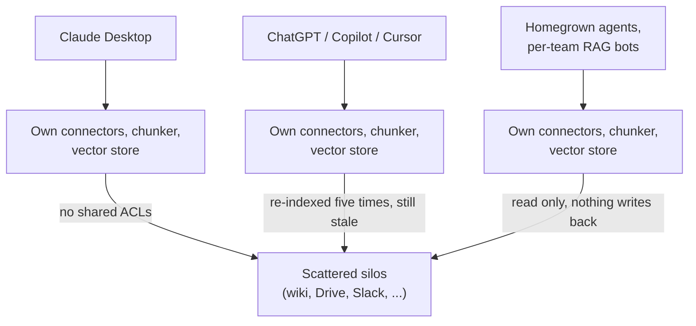
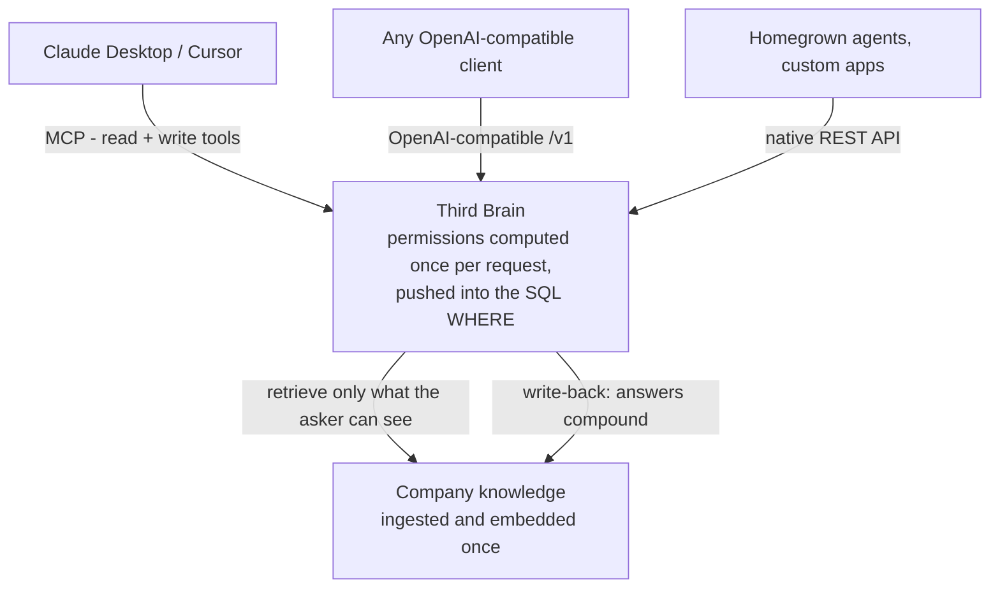

# Third Brain - Vision

> **The documentation writes itself.** A governed, model-agnostic company brain that your LLM
> tools fill in as they work - captured once, permission-scoped, searchable by every model.

This document is the "why." For the "how," see [`ARCHITECTURE.md`](./ARCHITECTURE.md); for the
"what next," see [`ROADMAP.md`](./ROADMAP.md).

---

## Problem

Every company now runs a dozen LLM surfaces at once - Claude Desktop, Claude Code, ChatGPT,
Cursor, homegrown agents, per-team RAG bots - and an enormous amount of real company knowledge is
*created inside those sessions*. Each surface re-solves the same three problems badly:

1. **Nothing writes back, so the knowledge evaporates.** Answers, decisions and new facts vanish
   at the end of the chat, because writing the doc is the boring part nobody has time for. The
   same questions get re-answered, the same decisions re-litigated, and institutional memory stays
   trapped in closed tabs and people's heads.
2. **There is no shared permission model.** A model wired to the company wiki has no idea that
   *this* asker can't see the comp doc or the unreleased roadmap. So security either says "no" or
   looks the other way. Both are bad.
3. **Retrieval is rebuilt from scratch, everywhere.** Every tool ships its own connectors, chunker
   and vector store. Knowledge is re-indexed five times and still stale in all five.

LLMs feel magical in a demo and useless at work because at work the hard part isn't generation; it
is *capturing what the work produces and governing who can see it*.

## Why now

- **MCP made agents able to *write*, not just read.** One backend can now serve every LLM client
  through interfaces they already speak, and expose write tools the agent calls as it works. That
  is what turns capture from a nagging chore into something the tools do themselves, without
  per-client integrations.
- **Embeddings + pgvector got cheap and good enough.** Permission-filtered semantic search over
  millions of chunks runs on commodity Postgres, not a specialized vector DB fleet.
- **Every company is standing up "AI" and hitting the governance wall.** 2024-2026 turned "let's
  try an LLM" into "we have eight of them and no policy." The pain is acute and immediate.
- **Model churn is permanent.** Teams switch models monthly, and nobody wants their knowledge
  locked to one vendor's RAG. Model-agnostic is a requirement, not a nicety.

## Solution

The shift in one picture - today every surface re-implements retrieval against scattered silos;
with Third Brain they all plug into one governed layer:

Third Brain is a single, multi-tenant service that:

- **Documents the work as it happens.** Agents connected over MCP call `add_knowledge` /
  `update_knowledge` to file decisions, answers and notes into the right collection, so the doc
  gets written without anyone stopping to write it. This is the wedge: a chore nobody does becomes
  a byproduct of the work everyone is already doing.
- **Enforces permissions at retrieval time** - org → team → user RBAC plus per-collection and
  per-document ACLs, computed once per request and pushed into the SQL `WHERE` clause. A chunk you
  can't see can never enter a prompt, even indirectly. This is the trust pillar that makes a brain
  agents both read *and* write safe to turn on, and it is genuinely hard to retrofit.
- **Serves every model** - a native REST API, an **OpenAI-compatible `/v1`** endpoint, and a
  first-class **MCP server** with read *and* write tools; the generation layer speaks any
  OpenAI-compatible endpoint plus native Anthropic and Google Gemini.
- **Ingests once** - files, URLs, raw text, and soon live connectors to Slack/Drive/Notion - and
  keeps a governed, embedded, deduplicated copy of company knowledge alongside what the agents
  write.

The product surface is deliberately boring-in-the-best-way: it looks like a clean management
dashboard (usage, keys, teams, connectors, audit, and an **Agent-written** view of what the agents
captured), except the thing it governs is *knowledge* instead of tokens.

## Free, open source, self-hosted

Third Brain is **free** and **Apache-2.0** licensed: no paid edition, no hosted plan, no seat
count, and nobody is ever billed for it. Everything is in this repository - the permission engine,
hybrid search, agent write-back, SSO/SAML + SCIM, audit, the dashboard, the MCP server and the
`third-brain-mcp` CLI.

It is **self-hosted by design**, and that is the whole point rather than a fallback:

- **You hold the data.** Documents, chunks, embeddings, permissions, usage records and the audit
  log live only in the Postgres, Redis and file/object storage you run. There is no other copy
  anywhere.
- **You bring the model keys.** Provider credentials are yours, set as environment variables or
  per-org connectors, and calls go straight from your deployment to the provider you picked -
  including OpenAI-compatible endpoints on your own network (Ollama, vLLM, a gateway) that never
  leave it.
- **Nothing phones home.** A default deployment makes zero outbound calls: telemetry is opt-in,
  storage is local, and with no provider key at all a deterministic offline stub runs the whole
  pipeline. ["Nothing phones home"](./SELF_HOSTING.md#nothing-phones-home) shows how to verify that
  with an egress-deny policy.
- **The only money involved is your own infrastructure and provider spend.** The dashboard's usage
  and cost figures exist so an operator can see what their own OpenAI / Anthropic / Gemini keys are
  costing them. Nothing charges you for Third Brain, because nothing can.

[`SELF_HOSTING.md`](./SELF_HOSTING.md) is the one-command route; [`DEPLOYMENT.md`](./DEPLOYMENT.md)
is the deeper production runbook.

## Who it's for

- **Teams already running several LLM surfaces at once** who have hit the governance wall:
  scattered knowledge, real ACL requirements, and a security team with veto power over "just point
  the model at the wiki."
- **The engineers wiring the agents up** - internal-tools and applied-AI people who would rather
  have one governed backend every client plugs into than five half-built RAG stacks.
- **Regulated teams** (fintech, health, legal) where "the model can only see what the user can
  see" is a hard requirement rather than a preference, and where the data cannot leave the
  perimeter at all.
- **Individuals and small teams.** It runs on a single box (`make selfhost`), and with zero
  provider keys the offline stub keeps the whole pipeline working end to end.

## Design principles

1. **One permission engine, enforced in SQL.** `app/services/permissions.py` authorizes routes
   *and* builds the retrieval scope, which becomes a `WHERE` predicate over `document_chunks`.
   There is no second, weaker copy of the rules in the retrieval path.
2. **Model-agnostic, bring your own keys.** Any OpenAI-compatible endpoint plus native Anthropic
   and Gemini, over plain `httpx` with no provider SDKs. Switching models is configuration, and
   your knowledge never becomes one vendor's asset.
3. **The write path is first-class.** Read-only RAG is half a product. Agents capture what they
   worked out, through the same permission gate and the same secret/DLP scanner as any human
   upload.
4. **Boring, portable infrastructure.** Postgres 16 with `pgvector` and Redis. No specialized
   vector-database fleet to operate, and the vector store sits behind an interface so another
   backend can drop in later.
5. **Works with nothing configured.** The whole stack comes up with zero provider keys and zero
   outbound network access. That is what makes it quick to try, deterministic to test, and honest
   about what it does when nobody is looking.
6. **Metadata-only observability.** Logs and traces never carry prompt, document or query content;
   see [`OBSERVABILITY.md`](./OBSERVABILITY.md).

## How this compares

- **DIY RAG stacks** (LangChain / LlamaIndex plus a vector DB). Maximum flexibility, but every
  team rebuilds permissions and almost nobody gets retrieval-time ACLs right. The usual outcome is
  a filter applied *after* the search, or in application code the next feature quietly bypasses.
- **Point knowledge assistants and vendor-locked enterprise search.** Strong search, but tied to
  their own model and ranking, read-only, and not a neutral layer every LLM plugs into. They index
  what someone already wrote down.
- **LLM gateways.** They govern *tokens*, not *knowledge*. Complementary, not overlapping.

Two things are genuinely hard, and are where the effort went. **Read-only RAG is the commodity** -
everyone has a chunker and a cosine similarity, but almost nothing makes the *capture* free, so
knowledge accumulates instead of evaporating at the end of a chat. And **permission-aware
retrieval is hard to retrofit** - it has to be enforced in the query path, in one place,
identically for route authorization and for retrieval. Bolted on afterwards it leaks; built in
from the start it is what makes agent write-back safe to turn on at all.

## Risks and how they are handled

- **Permission bugs are existential.** A single leaked chunk destroys the reason to use this.
  Mitigations: a single source of truth in `services/permissions.py`, enforcement pushed into SQL,
  and a permission-correctness eval harness that ships in the repo (`make benchmark`, see
  [`BENCHMARKING.md`](./BENCHMARKING.md)) and exits non-zero on any leak. Wiring it in as a hard
  release gate is [near-term](./ROADMAP.md).
- **Model vendors bundle "memory."** Any single vendor's memory is scoped to that vendor's tools
  and has no cross-tool permission model. Staying neutral - every client, every provider, your
  keys - is the answer, and it is a position an open project can hold indefinitely.
- **Prompt injection through ingested content.** Retrieval scope is computed *before* generation
  from the caller's identity, never from the model's output, so nothing an ingested document says
  can widen what the model is allowed to see. See [`SECURITY.md`](./SECURITY.md#threat-model).
- **Retrieval quality is a moving target.** Hybrid search plus reciprocal rank fusion is the
  current baseline; reranking is on the roadmap, and the eval harness exists so quality changes
  are measured rather than argued about.
